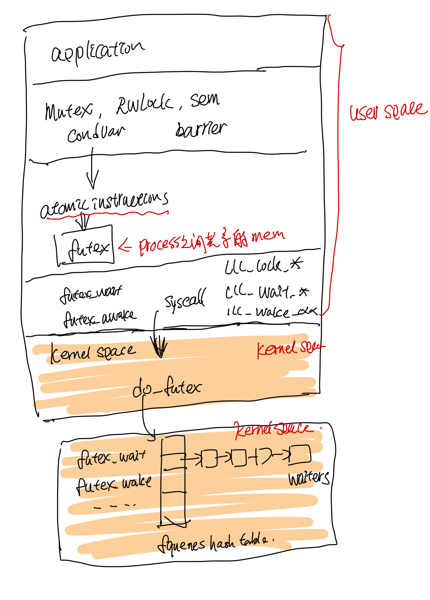

## Glibc的pthread实现代码研读 2: 线程同步

第二部分主要讲述pthread中的线程的同步方法包括mutex, sem, condition var, rwlock, barrier的实现，pthread使用了linux的futex来实现这些同步方法。

### futex

pthread中的locks通过linux的futex(faster user space locking)实现, lock放在process之间的共享内存中, pthread通过atomic的指令来对这个lock进行dec, inc, load and test 等操作, 如果有竞态冲突的时候获取锁失败的时候，才会去sys call 调用linux底层的do_futex, 底层把线程放到futex对应的wait队列里面, 然后挂起线程等待被唤醒。

由于只有竞态冲突的时候才需要syscall, 其他情况都不需要，因此节省了很多sys call，这样比较快。




#### Mutex
xchgl 这个是atomic操作吧，失败了回去调用do_futex, flag 是FUTEX_WAIT

```
phtread_mutex_lock --> LL_MUTEX_LOCK --> ll_lock --> lll_lock_wait|lll_lock_wait_private --> xchgl

```

#### Sem

#### Condition var

#### Read write lock

#### Barrier
