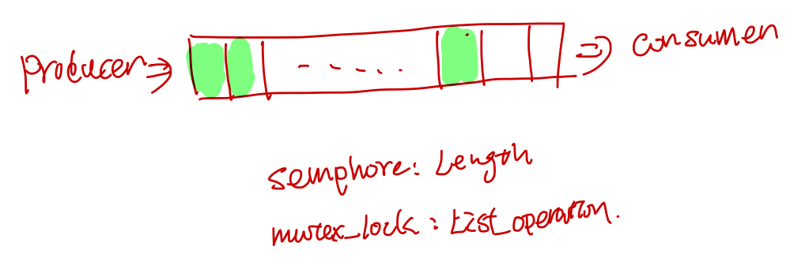

## Pthread primer 笔记

### 进程和线程

#### 在kernel中process的context

* cpu相关：program counter pointer, stack top pointer, cpu general registers, sates.
* 内存：memory map
* user: uid, gid, euid, egid, cwd.
* 信号: signal dispatch table
* File: file descriptors


#### thread的context data

* cpu相关：program counter pointer, stack top pointer, cpu general registers, sates.
* 内存相关: stack


<b>线程的stack是分配在process的heap上的</b>

```cpp
//设置和获取线程的stack address
include <pthread.h>
int pthread_attr_setstack(pthread_attr_t *attr, void *stackaddr, size_t stacksize);
int pthread_attr_getstack(const pthread_attr_t *attr, void **stackaddr, size_t *stacksize);
```

<b>整个进程只有一份signal dispatch table</b>

所以signal 中断的时候，说不准会中断到那个thread里面，需要加signal mask来处理。

#### 使用thread的好处

1. ``context switch``: process的上下文切换比thread的context switch 耗时间.
2. ``memory share``: thread之间的通信，共享process的内存，file等资源比process之间的通信，share内存方便.

### 线程调度和生命周期

#### 线程调度
线程有两种调度方式，一种是完全在user space, 由thread库做调度，优点是省了system call 从而省下了从user space 到kernel space的切换, 比较快，缺点是，有一个线程挂在IO上后，整个process都会被挂起.(可以把block的system call 改成nonblock的，使用asyc io来解决这个问题).

另外一种是kernel 实现的light weight process(lwp), lwp避免了整个线程被挂起的缺点，但是需要从user space 到kernel space的切换, 比完全user space实现的线程慢一点。

现实中这两种的实现的方式可以混合起来， 混合方式如下：
* 多个线程对应一个lwp
* 一个线程对应一个lwp
* 多个线程对应多个lwp

在pthread 中可以这么设置调度的属性:

```cpp
//pthread中设置调度scope
//PTHREAD_SCOPE_SYSTEM 表示system 全局的， PTHREAD_SCOPE_PROCESS 表示process scope的。
pthread_attr_t attr;
pthread_attr_init(&attr);
pthread_setscope(&atttr, PTHREAD_SCOPE_SYSTEM);
pthread_create(&tid, &attr, foo, NULL);
```

<b>影响线程调度的一些属性</b>
* scope: PTHREAD_SCOPE_PROCESS, PTHREAD_SCOPE_GLOBAL
* policy: SCHED_RR, SCHED_FIFO, SCHED_OTHER
* priority
* inheritance

<b>线程状态以及状态之间的迁移关系如下图：</b>


<b>四种running中的线程被切出去的状况</b>

* synchronization 线程require lock的失败被挂在lock的sleep queue上。
* preemption 被抢占了，T1在运行的时候，一个更高优先级的线程T2到了runnable的状态, T1会被T2抢占了。
* yielding. 线程T1主动调用sched_yield, 如果有和T1优先权一样的T2线程，就切换到T2线程，如果没有，T1就接着运行。
* time-slicing. T1的时间片用完了，和T1有同样优先权的T2接着运行。

### 线程的生命周期

#### 创建和退出线程
```cpp
//create
int pthread_create(pthread_t *thread, const pthread_attr_t *attr, void *(*start_routine)(void *), void *arg);
//exit
void pthread_exit(status);
```

线程的返回值，一种是函数执行结束后，直接return的值，另外一种是pthread_exit(status)这个的返回值。

#### join

join之后线程会处于阻塞状态直到等待的线程T1执行完毕，join之后t1线程的相关内存会被清理掉，所以说一个子线程只能被join一次.

设置线程的属性为joinable

```cpp
pthread_t thread_id;
pthread_attr_t attr;
pthread_attr_init(&attr);
pthread_attr_setdetachstate(&attr, PTHREAD_CREATE_JOINABLE);
pthread_create(&thread_id, &attr, work, (void *)arg);
```

阻塞等待线程的执行结果，获取线程的返回结果
```cpp
//等待t1线程执行结束, exit_status 是子线程的返回值.
pthread_join(t1, &exit_status)
```

joinable线程和detehced线程的区别是线程结束的时候，资源(线程对应的标识符pthread_t, 线程返回信息)该怎么释放.

对于joinable线程t1, 只有当其他线程对t1调用了pthread_join之后, 线程t1才会释放所占用的资源, 否则 会进入类似于进程的zombile状态，这些资源不会被会回收掉.

#### detach
如果想要t1线程执行结束收系统自动回收t1的资源, 而不是通过调用pthread_join回收资源(会阻塞线程), 我们可以将线程设置为deteched, 有三种方式可以设置线程为deteched.

* 创建线程时指定线程的 detach 属性: pthread_attr_setdetachstate(&attr, PTHREAD_CREATE_DETACHED);
* 通过在子线程中调用 pthread_detach(pthread_self());
* 在主线程中调用 pthread_detach(thread_id);(非阻塞, 执行完会立即会返回)

#### 使用信号量

使用信号量等待一堆子线程执行结束, 在主线程里面调用thread_signle_barrier, 然后子线程结束的时候调用``SEM_POST(barrier)``

```cpp
void thread_signle_barrier(sem_t* barrier, int count){
    while( count > 0) {
        SEM_WAIT(barrier);
        count--;
    }
}
```
### 线程的同步

### atomic 指令
线程执行的时候，在两个指令之间，随时都可能会被抢占掉, 所以需要一个atomic的指令来避免这种状况.

#### atomic test and set style: ldstub

ldstub (load and store unsigned byte) 就是一个atomic test and set的指令, 从内存中载入一个unsigned字节，并且把内存中那个字节设置为1.

<b>一个mutex lock的实现</b>
```
try_agin: ldstub address -> register
          compare register, 0
          branch_equal got_it
          call go_to_sleep
          jump try_again
got_it:  return
```
从这儿可以看到，线程从go_to_sleep返回之后，需要去重新获取lock, 如果获取失败，就接着go_to_sleep.


### basic primitive

所有线程之前shared的数据需要被用lock保护起来，比如全局数据，传入到另外一个线程的Data struct， 还有static数据。

#### mutex lock(互斥锁)

线程获取mutex lock失败以后，会被放到mutex对应的sleep队列中。

```cpp
pthread_mutex_lock
//critical section
pthread_mutex_unlock
```


另外一种非阻塞的获取锁的方法``pthread_mutex_trylock`` 如果获取锁成功返回0，否则返回``EBUSY``.

#### semaphores(信号量)
信号量机制用于协调多个资源的使用(比如一个队列或者缓冲区)，semaphores的值表示可用资源的数量(队列中可用资源的个数)。常用于解决生产者和消费者问题.

```cpp
// 初始化
int sem_init(sem_t *sem, int pshared, unsigned int val);
// 没有可用的信号量就等待，否则
int sem_wait(sem_t *sem);
// 释放一个信号量，信号量的值加1
int sem_post(sem_t *sem);

信号量流程
```


生产者消费者问题, 假设队列的长度是20:


```cpp
#include <semaphore.h>

//shared global vars
sem_t sem_producer;
sem_t sem_consumer;
//list

void producer(){
    while(1){
        sem_wait(sem_consumer);
        pthread_mutex_lock(list_lock);
        add(list);
        pthread_mutex_unlock(list_lock);
        sem_post(sem_producer);
    }
}

void consumer(){
    while(1) {
        sem_wait(sem_producer);
        pthread_mutex_lock(list_lock);
        consume(list);
        pthread_mutex_unlock(list_lock);
        sem_post(sem_consumer);
    }
}
void main(){
    sem_init(&sem_producer, 0);
    sem_init(&sem_consumer, 20);

    pthread_t producer_tid;
    pthread_t consumer_tid;

    pthread_create(&producer_tid, nullptr, producer, nullptr);
    pthread_create(&consumer_tid, nullptr, consumer, nullptr);
}
```


#### condition var (条件变量)
condition var 的流程, condition var 访问需要用个mutex lock保护起来, condition判断失败之后，会unlock 保护condition var 的lock, 然后进入sleep, 之后被唤醒的时候，会再次去获取condition var的lock。


```cpp
// 初始化
pthread_cond_t cond = PTHREAD_COND_INITIALIZER;
// 动态初始化
int pthread_cond_init(pthread_cond_t *restrict cond, const pthread_condattr_t *restrict attr);

//销毁
int pthread_cond_destroy(pthread_cond_t *cond);

//等待
int pthread_cond_wait( pthread_cond_t *   restrict cond, pthread_mutex_t *  restrict mutex );
int pthread_cond_timedwait( pthread_cond_t *         restrict cond, pthread_mutex_t *        restrict mutex, const struct timespec *  restrict abstime );


// 通知
// singal 函数一次只能唤醒一个线程, 而 broadcast 会唤醒所有在当前条件变量下等待的线程.
int pthread_cond_broadcast(pthread_cond_t *cond);
int pthread_cond_signal(pthread_cond_t *cond);
```

wait for condition
```
// safely examine the condition, prevent other threads from
// altering it
pthread_mutex_lock (&lock);
while ( SOME-CONDITION is false)
    pthread_cond_wait (&cond, &lock);

// Do whatever you need to do when condition becomes true
do_stuff();
pthread_mutex_unlock (&lock);
```
signal condition

```
// ensure we have exclusive access to whathever comprises the condition
pthread_mutex_lock (&lock);

ALTER-CONDITION

// Wakeup at least one of the threads that are waiting on the condition (if any)
pthread_cond_signal (&cond);

// allow others to proceed
pthread_mutex_unlock (&lock)
```

### read write lock (读写锁)

在某个时间内，多个线程可以同时获得读锁, 如果已经有线程获得了读锁，那么尝试获取写锁的将被block, 如果已经有线程获取了读锁，那么其他线程的尝试获取读锁或者写锁将会被block.


```cpp
pthread_rwlock_t rwlock;
int pthread_rwlock_init(pthread_rwlock_t *restrict rwlock, const pthread_rwlockattr_t *restrict attr);
int pthread_rwlock_destroy(pthread_rwlock_t *rwlock);

// 获取读锁
int pthread_rwlock_rdlock(pthread_rwlock_t *rwlock);
// 获取写锁
int pthread_rwlock_wrlock(pthread_rwlock_t *rwlock);
// 释放锁
int pthread_rwlock_unlock(pthread_rwlock_t *rwlock);
```

### Spin lock (自旋锁)

多次trylock, 如果失败了再block, 它的出发点是trylock这个指令的时间很短（比如2us)然后mutex block一次可能需要42us,所以它先尝试几次, 如果在这几us内，lock被释放了，那么能够成功的获取锁了。
```cpp
spin_lock(mutex_t *m) {
    for(int i = 0; i < SPIN_COUNT; i++) {
        if (pthread_mutex_trylock(m) != EBUSY) {
            return;
        }
    }
    pthread_mutex_lock(m);
    return;
}
```

<b>Adaptive Spin lock</b>

在很多kernel里面使用的，kernel先看拥有锁的线程在不在running(如果在跑的话，那么线程可能短时间内会释放这个锁，所以值得spin几次去尝试下), 如果不在running 状态的话，就直接去require lock了,然后线程会被block.

使用spin lock的时候，需要好好的评估下到底值不值得，就是critical section hold住lock的时间会不会很长。。如果一般很短的话，值得用spin lock，否则的话用spin lock反而浪费时间。

### Barriers
```c
pthread_barrier_t mybarrier;
//初始化
pthread_barrier_init(&mybarrier, NULL, THREAD_COUNT + 1);
pthread_barrier_destroy(&mybarrier);
pthread_barrier_wait(&mybarrier);
```

等待最后一个线程达到barrier点。

### cancelation


### signals

## pthread FAQ
* Under what conditions will a process exit
* What happens when a pthread gets created? (you don't need to go into super specifics)
* Where is each thread's stack?
* How do you get a return value given a a pthread_t? What are the ways a thread can set that return value? What happens if you discard the return value?
* Why is pthread_join important (think stack space, registers, return values)?
* What does pthread_exit do under normal circumstances (ie you are not the last thread)? What other functions are called when you call pthread_exit?
* Give me three conditions under which a multithreaded process will exit. Can you think of any more?


## 附录
1. linux中的process的virutal memory layout 参见[Processes and Memory Management](http://www.enseignement.polytechnique.fr/informatique/INF583/INF583_5.pdf)


## 参考
1. [pthread primer](http://www8.cs.umu.se/kurser/TDBC64/VT03/pthreads/pthread-primer.pdf)
2. [Processes and Memory Management](http://www.enseignement.polytechnique.fr/informatique/INF583/INF583_5.pdf)
3. [pthread学习笔记, 基本使用](http://blog.zhangjikai.com/2016/04/25/%E3%80%90Pthreads%E5%AD%A6%E4%B9%A0%E7%AC%94%E8%AE%B0%E3%80%91%E5%9F%BA%E6%9C%AC%E4%BD%BF%E7%94%A8/)
