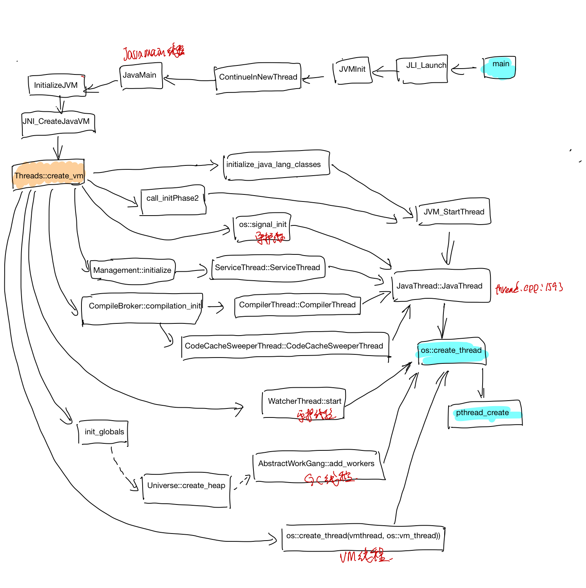

## Hotspot代码研读: jvm 初始化时创建的线程

#### 创建线程的callstack

由于创建线程最终肯定会调用pthread_create方法，所以为了研究jvm启动的时候，创立了哪些线程，准备了下面的lldb调试脚本。在pthread_create方法上打断点，然后用bt命令打印callstack， 然后continue接着执行, 去打印下一个pthread_create的callstack, 这样最后就可以得到所有的pthread_create的callstack了。

HelloWorld.java
```java
public class HelloWorld {
    public static void main(String[] args) {
        System.out.println("hello,world");
    }
}
```
HelloWorld.lldb
```sh
//hello.lldb
file /codes/openjdk/build/macosx-x86_64-normal-server-slowdebug/jdk/bin/java
settings set frame-format "frame #${frame.index}: ${line.file.basename}:${line.number}: ${function.name}\n"
#breakpoints
breakpoint set --name main
breakpoint command add
process handle SIGSEGV --notify false --pass true --stop false
continue
DONE

breakpoint set --name pthread_create
breakpoint command add
bt
continue
DONE

run HelloWorld
```
执行lldb 脚本
```bash
#编译HelloWorld.java
$javac HelloWorld.java
#执行lldb脚本
$lldb -s HelloWorld.lldb
```

最后得到的[pthread_create_bt.log](./src/pthread_create_bt.log), pthread call stack关系整理如下图:



#### 线程创建的过程

main是java的laucher入口，在``main-> JLI_LAUCH -> LoadJavaVM ``中会调用dlopen加载libjvm的so, 设置好JNI_CreateJavaVm的函数指针.
```cpp
// main -> JLI_LAUCH -> LoadJavaVM:
// load libjvm so
#ifndef STATIC_BUILD
    libjvm = dlopen(jvmpath, RTLD_NOW + RTLD_GLOBAL);
#else
    libjvm = dlopen(NULL, RTLD_FIRST);
#endif
//other codes
ifn->CreateJavaVM = (CreateJavaVM_t)
       dlsym(libjvm, "JNI_CreateJavaVM");
```
然再``main->JLI_LAUCH -> JVMinit -> ContinueInNewThread``创建一个新的线程。新的线程开始执行JavaMain函数.

在JavaMain中最终调用Threads::create_vm 创建java vm中的其他线程。

```cpp
//JNI_CreateJavaVM jni.cpp:4028
frame #13: thread.cpp:3623: Threads::create_vm(JavaVMInitArgs*, bool*)
frame #14: jni.cpp:3938: JNI_CreateJavaVM_inner(JavaVM_**, void**, void*)
frame #15: jni.cpp:4033: ::JNI_CreateJavaVM(JavaVM **, void **, void *)
frame #16: java.c:1450: InitializeJVM
frame #17: java.c:402: JavaMain
```

#### 线程class之间的继承关系
线程class之间的继承关系如下:


#### JavaThread

#### VMThread
