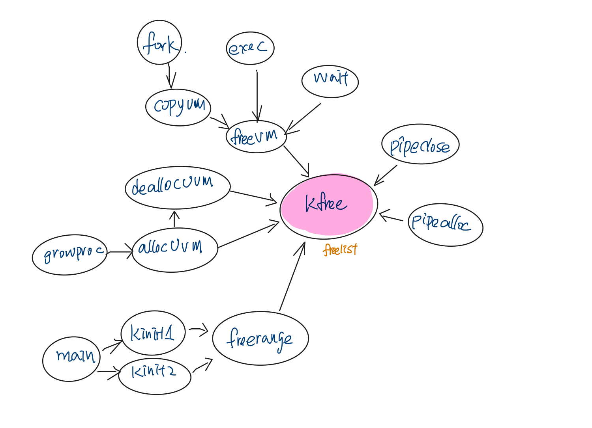
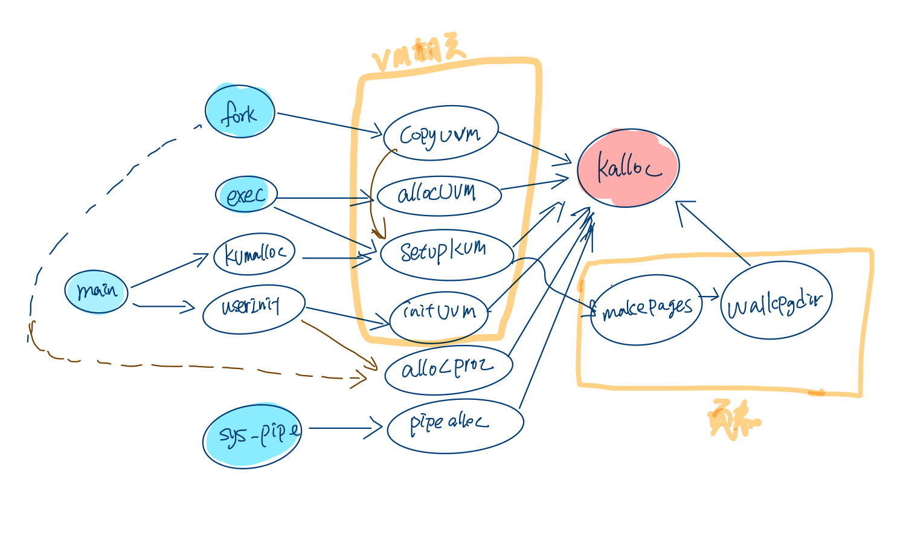
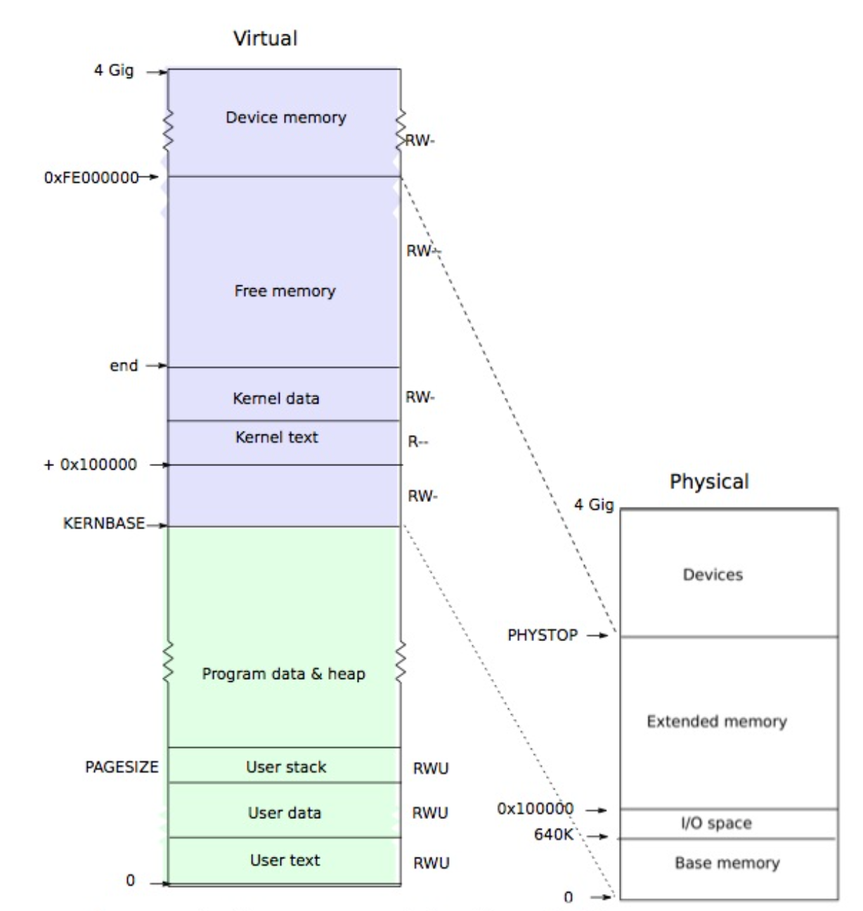
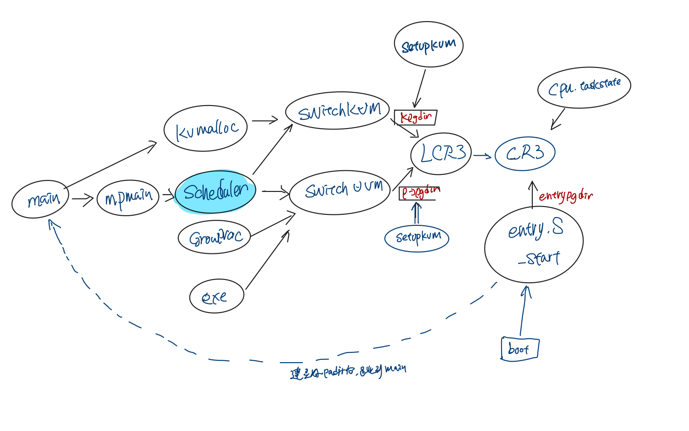
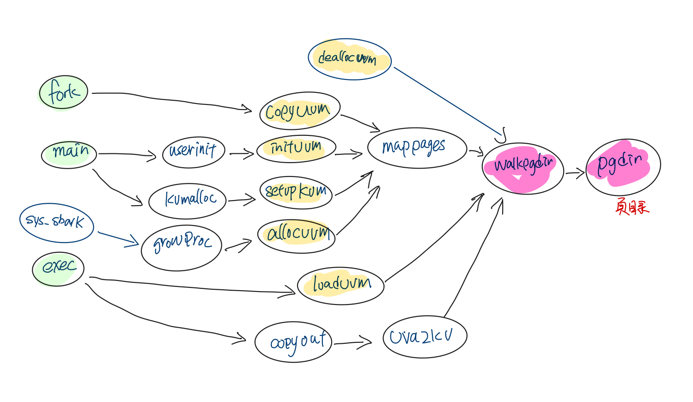

Xv6: 内存管理
============
- [摘要](#摘要)
- [x86内存管理](#x86内存管理)
- [物理内存](#x86内存管理)
    - [freelist的初始化](#freelist的初始化)
    - [kfree](#kfree)
    - [kalloc](#kalloc)

- [虚拟内存](#x86内存管理)
    - [虚拟内存layout](#虚拟内存layout)
    - [页表](#页表)
- [参考](#参考) 

摘要
----

本文结合xv6 project的书，整理分析了xv6内存管理部分的代码，重点研究了页表建立的过程，以及fork之后，父进程子进程之间页表的关系。


x86 内存管理
-----------

段地址 -> 虚拟地址 -> 物理地址


物理内存管理
-----------

物理内存管理相关的代码在kalloc.c中。

#### freelist的初始化

xv6中物理内存由freelist管理起来，分别由kalloc, kfree来释放和管理物理内存，每次alloc和free的内存都是1页大小（PAGESIZE)的内存。

freelist的初始化分两步，kinit1和kint2，kinit1建立0~4M之间内存的freelist, kint2建立4M到PHYSTOP内存之间的freelist

kinit1的时候，只有一个cpu在run, 所以对freelist的操作不需要通过kmem.lock, 在kinit2的时候，startothers启动了其它的CPU, 这个时候对freelist的操作就需要通过lock了。

```c
//os main的入口
main(){
    kinit1(end, P2V(4*1024*1024));
    //othercodes
    startothers();//启动其它的cpu
    kinit2(4*1024*1024, P2V(PHYSTOP);
    //other codes
}


void
kinit1(void *vstart, void *vend)
{
  initlock(&kmem.lock, "kmem");
  kmem.use_lock = 0;
  freerange(vstart, vend);
}

//kinit2的时候，其它的cpu已经start了，所以对freelist的操作要用lock了。
void
kinit2(void *vstart, void *vend)
{
  freerange(vstart, vend);
  kmem.use_lock = 1;
}
```


#### kfree

kfree释放一页内存回到kmem.freelist中。

```c
void
kfree(char *v)
{
  struct run *r;

  if((uint)v % PGSIZE || v < end || V2P(v) >= PHYSTOP)
    panic("kfree");

  // Fill with junk to catch dangling refs.
  memset(v, 1, PGSIZE);

  if(kmem.use_lock)
    acquire(&kmem.lock);
  r = (struct run*)v;
  r->next = kmem.freelist;
  kmem.freelist = r;
  if(kmem.use_lock)
    release(&kmem.lock);
}
```

##### kfree的调用者

kfree的调用者如下图，



- <b>freerange</b> 在系统初始化的时候调用，建立初始的freelist, 第一次从end到4M空间，第二次从4M到PHYSTOP剩余的物理空间。

```c
  kinit1(end, P2V(4*1024*1024)); // phys page allocator
  kinit2(P2V(4*1024*1024), P2V(PHYSTOP)); // must come after startothers()
```


- <b>freevm</b> 释放页目录表中虚拟内存页对应的物理内存, 并且释放页目录本身占用的内存。在fork,exec失败或者wait zombile子进程的时候
会调用freevm释放进程所有的物理内存。

- <b>deallocuvm</b> 释放虚拟内存对应的物理内存, 并更新页表的映射。

- <b>allocuvm</b> 在分配物理内存页失败(out of memeory)的时候，或者页表映射失败的时候，会释放已分配的物理内存页。

- <b>pipalloc</b> 失败的时候，会去把已申请的内存释放掉. 

- <b>pipclose</b> 释放掉struct pipe缓冲区.

#### kalloc

kalloc从kmem.freelist中分配一页内存.

```c
char*
kalloc(void)
{
  struct run *r;

  if(kmem.use_lock)
    acquire(&kmem.lock);
  r = kmem.freelist;
  if(r)
    kmem.freelist = r->next;
  if(kmem.use_lock)
    release(&kmem.lock);
  return (char*)r;
}
```

##### kalloc的调用者




- <b>allocuvm</b>用于分配虚拟内存，分配的时候，分配好物理内存，并调用mappages创建页目录, 做好虚拟内存到物理内存的映射。

- <b>inituvm</b> 分配一页内存，把bianry_initcode_start memmove到那个内存中, 并调用mappages创建虚拟内存到物理内存的映射。

```
  inituvm(p->pgdir, _binary_initcode_start, (int)_binary_initcode_size);
```

bianry_initcode 这个代码是initcode.s， 由链接器link到内核中，并定了binary_initcode_start, binary_initcode_size 这两个符号。
可以在makefile中看到这部分的定义。

```makeFile
111:initcode: initcode.S
112:	$(CC) $(CFLAGS) -nostdinc -I. -c initcode.S
113:	$(LD) $(LDFLAGS) -N -e start -Ttext 0 -o initcode.out initcode.o
114:	$(OBJCOPY) -S -O binary initcode.out initcode
115:	$(OBJDUMP) -S initcode.o > initcode.asm

117:kernel: $(OBJS) entry.o entryother initcode kernel.ld
118:	$(LD) $(LDFLAGS) -T kernel.ld -o kernel entry.o $(OBJS) -b binary initcode entryother
129:kernelmemfs: $(MEMFSOBJS) entry.o entryother initcode kernel.ld fs.img
130:	$(LD) $(LDFLAGS) -T kernel.ld -o kernelmemfs entry.o  $(MEMFSOBJS) -b binary initcode entryother fs.img
```

- <b>setupkvm</b> 
- <b>copyuvm</b> 
- <b>allocproc</b> 
- <b>pipalloc</b> 


虚拟内存
-------

### 虚拟内存layout

memlayout.h中定义了一些宏标明了虚拟内存layout的

```
#define EXTMEM  0x100000            // Start of extended memory
#define PHYSTOP 0xE000000           // Top physical memory
#define DEVSPACE 0xFE000000         // Other devices are at high addresses

// Key addresses for address space layout (see kmap in vm.c for layout)
#define KERNBASE 0x80000000         // First kernel virtual address
#define KERNLINK (KERNBASE+EXTMEM)  // Address where kernel is linked

#define V2P(a) (((uint) (a)) - KERNBASE)
#define P2V(a) (((void *) (a)) + KERNBASE)

#define V2P_WO(x) ((x) - KERNBASE)    // same as V2P, but without casts
#define P2V_WO(x) ((x) + KERNBASE)    // same as P2V, but without casts
```



虚拟内存的从kernelbase到4G这一段是kernel空间，这部分虚拟内存的页表由setupkvm建立

```c
static struct kmap {
  void *virt;
  uint phys_start;
  uint phys_end;
  int perm;
} kmap[] = {
 { (void*)KERNBASE, 0,             EXTMEM,    PTE_W}, // I/O space
 { (void*)KERNLINK, V2P(KERNLINK), V2P(data), 0},     // kern text+rodata
 { (void*)data,     V2P(data),     PHYSTOP,   PTE_W}, // kern data+memory
 { (void*)DEVSPACE, DEVSPACE,      0,         PTE_W}, // more devices
};

// Set up kernel part of a page table.
pde_t*
setupkvm(void)
{
  pde_t *pgdir;
  struct kmap *k;

  if((pgdir = (pde_t*)kalloc()) == 0)
    return 0;
  memset(pgdir, 0, PGSIZE);
  if (P2V(PHYSTOP) > (void*)DEVSPACE)
    panic("PHYSTOP too high");
  for(k = kmap; k < &kmap[NELEM(kmap)]; k++)
    if(mappages(pgdir, k->virt, k->phys_end - k->phys_start,
                (uint)k->phys_start, k->perm) < 0)
      return 0;
  return pgdir;
}
```


### 页表

entrypgdir, 1kb大小，包含1024个条pde_t,

三种页表,entrypgdir, kpgdir, process->pgdir,  kpgdir是内核的页表，process->pgdir是进程自己的页表，entrypgdir是bootstrap时候，在进入main之前用的页表。

在x86中cr3控制寄存器存放页目录(pgdir)的物理地址, 在``entry.s``的``_start``入口中会把entrypgdir地址load到cr3寄存器中。kpgdir由switchkvm载入到cr3中，进程的pgdir由switchuvm load到cr3寄存器中。

每个CPU在启动之后，会进入scheduler的死循环中，做进程之间的调度，遍历ptable(process table), 把runnable的进程切换为running状态, 在切换进程的时候，会切换进程的页表。

关于cr3寄存器的call tree 如下图:



setupkvm创建每个进程的kernel部分的虚拟内存的页表，然后进程的loaduvm, allocuvm等创建进程用户空间部分的虚拟内存页表。

pgdir的call tree如下图:





```
4:      typedef uint pde_t;

125:    #define NPDENTRIES      1024    // # directory entries per page directory

__attribute__((__aligned__(PGSIZE)))
pde_t entrypgdir[NPDENTRIES] = {
  // Map VA's [0, 4MB) to PA's [0, 4MB)
  [0] = (0) | PTE_P | PTE_W | PTE_PS,
  // Map VA's [KERNBASE, KERNBASE+4MB) to PA's [0, 4MB)
  [KERNBASE>>PDXSHIFT] = (0) | PTE_P | PTE_W | PTE_PS,
};

```


```
main -> startothers -> entrypgdir

#By convention, the _start symbol specifies the ELF entry point.
_start -> entry -> entrypgdir
_start -> main
```


为什么这个地方是先switchuvm然后切换了cpu的context最后再switchkvm呢？


参考
---
[X86 CPU Registers](http://wiki.osdev.org/CPU_Registers_x86)
