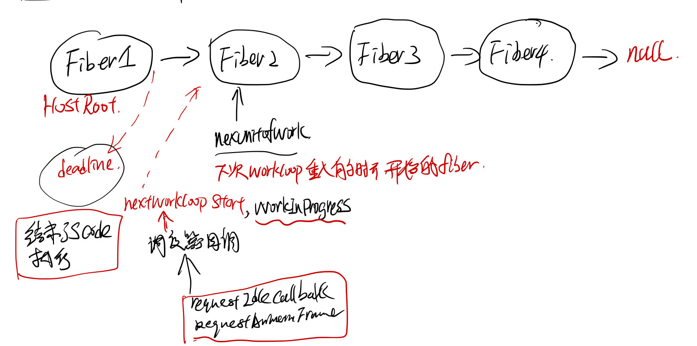

## React中state render到html dom的流程分析

### Questions

1. React的component的lifecycle 在react中是怎么被调到的.
2. 分析jsx => element tree => fiber tree => html dom在react中的流程.
3. react中的fiber tree的建立和执行, 以及异步的schedule.


### 研究工具和方法
* chrome 打断点
* ag the sliver searcher, 源代码搜索，分析
* 猜测它的实现原理，打log验证 打call trace验证,console.log, console.trace;

### 准备工作

代码下载,编译

```bash
$ git clone git@github.com:facebook/react.git
$ cd react
$ yarn install
$ gulp react:extract-errors
$ yarn build
```

### Component lifeCycle callback

准备最简单的组件HelloWorld

```jsx
import React from "react"
import ReactDom from "react-dom"

class HelloWorld extends React.Component{
    constructor(props){
        super(props);
        this.state = {
            message: "hello, world"
        }
    }

    componentWillMount(){
        console.log("component will mount");
    }

    componentWillUpdate(){
        console.log("component will update");
    }

    componentDidUpdate(){
        console.log("component did update");
    }

    componentDidMount(){
        console.log("componentDidMount");
    }

    render(){
        return <span className={this.state.message}>
            {this.state.message}
        </span>;
    }
}
ReactDom.render(<HelloWorld/>, document.getElementById("app"));
```
在``componentWillMount``, ``componentDidMount``, ``componentWillUpdate``, ``componentDidUpdate``中打个断点


### 创建html dom的callstack

react中最后一定会去调用``document.createElement``去创建html的dom节点，所以把document.createElement这个方法覆盖了，加了一层log.

```javascript
var originCreateElement = document.createElement;
document.createElement = function() {
    if (arguments[0] === 'span'){
        console.log('create span');
    }
   return originCreateElement.apply(document, arguments);
}
```
然后打断点，得到的callstack如下:


### call flow 整理

函数间的callflow 整理如下


函数所属模块之间的call flow 整理如下


## Fiber

#### fiber的设计思想
在[react-fiber-artchitecture](https://github.com/acdlite/react-fiber-architecture) 中作者描述了fiber的设计思想，简单来说，每个fiber就是一个执行单元，可以任意的修改它的优先级，可以pause 它，之后再继续执行（感觉很像进程线程的概念）。

实际中执行一个fiber可以生成下一步要执行的fiber，然后fiber执行之前可以检查时候js跑的时间时候用完了，如果用完了，就挂起来，等待下次requestIdleCallback/requestAnimationFrame的callback, schedule 开始接着上次结束的地方继续执行js code.

相当于把以前的js function 的call stack 改成fiber chain了。



``workLoop`` 函数主要逻辑如下（注，删除了错误处理和其他不相干的``if else`` 分支)
performWork

```javascript
// ReactScheduler.js workLoop
if (deadline !== null && priorityLevel > TaskPriority) {
      // The deferred work loop will run until there's no time left in
      // the current frame.
      while (nextUnitOfWork !== null && !deadlineHasExpired) {
        if (deadline.timeRemaining() > timeHeuristicForUnitOfWork) {
          nextUnitOfWork = performUnitOfWork(nextUnitOfWork);
          if (nextUnitOfWork === null && pendingCommit !== null) {
           // If we have time, we should commit the work now.
           if (deadline.timeRemaining() > timeHeuristicForUnitOfWork) {
             commitAllWork(pendingCommit);
             nextUnitOfWork = findNextUnitOfWork();
             // Clear any errors that were scheduled during the commit phase.
           }
         }
       }
   }
  }
````

#### schedule
schedule 有同步和异步的，同步的会一直执行，直到fiber tree被执行结束，不会去检查time限制和priorityLevel的问题，异步的有两类权限，一个是animation的，一类是HighPriority, OffScreen Priority这个会有个deadline.


在preformwork的末尾会去检查nextLevelPriority的优先权，然后根据优先权异步的schedule.
```javascript
switch (nextPriorityLevel) {
      case SynchronousPriority:
      case TaskPriority:
        // Perform work immediately by switching the priority level
        // and continuing the loop.
        priorityLevel = nextPriorityLevel;
        break;
      case AnimationPriority:
        scheduleAnimationCallback(performAnimationWork);
        // Even though the next unit of work has animation priority, there
        // may still be deferred work left over as well. I think this is
        // only important for unit tests. In a real app, a deferred callback
        // would be scheduled during the next animation frame.
        scheduleDeferredCallback(performDeferredWork);
        break;
      case HighPriority:
      case LowPriority:
      case OffscreenPriority:
        scheduleDeferredCallback(performDeferredWork);
        break;
    }
```

#### fiber执行的三个阶段

``react``中的``fiber``执行的执行主要分为三个阶段

1. ``beginWork``: fiber展开（把ClassComponent render开来，最后展开到fiber tree的叶子节点都是hostComponent)

2. ``completeWork``: 计算fiber之间的diff, 底层的dom元素的创建，以及dom tree的建立，还有事件绑定。

3. ``commitWork``: 调用host接口，把fiber的diff更新到host上去.


#### fiber类型

FunctionalComponent, ClassComponent 对应着用户创建的Component, HostRoot, HostComponent, HostPortal, HostText这些是和平台相关的组件。对于web来说就是 div, span这些dom元素了。

```javascript
// ReactTypeOfWork.js
module.exports = {
  IndeterminateComponent: 0, // Before we know whether it is functional or class
  FunctionalComponent: 1,
  ClassComponent: 2,
  HostRoot: 3, // Root of a host tree. Could be nested inside another node.
  HostPortal: 4, // A subtree. Could be an entry point to a different renderer.
  HostComponent: 5,
  HostText: 6,
  CoroutineComponent: 7,
  CoroutineHandlerPhase: 8,
  YieldComponent: 9,
  Fragment: 10,
};
```

### Fiber 执行过程分析
#### ClassComponent
#### HostRoot
#### HostComponent
#### HostText
