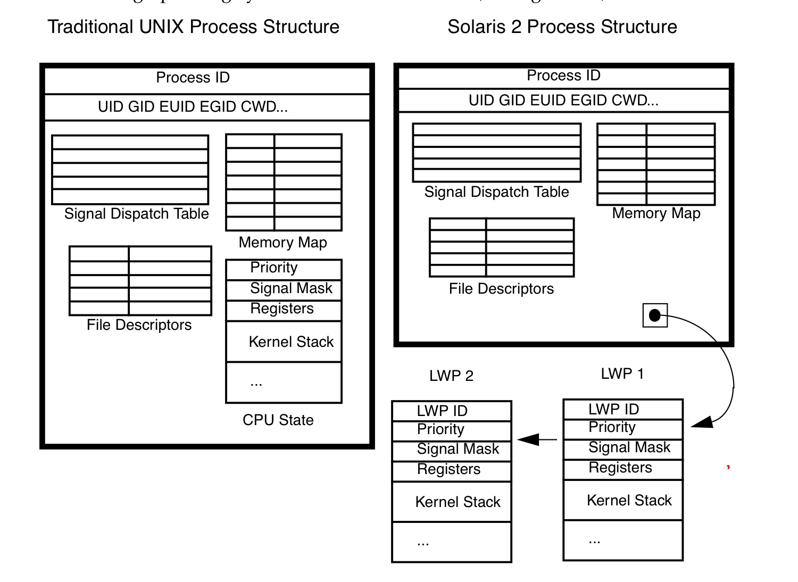

## Pthread primer 笔记

### 进程和线程

#### 在kernel中process的context

* cpu相关：program counter pointer, stack top pointer, cpu general registers, sates.
* 内存：memory map
* user: uid, gid, euid, egid, cwd.
* 信号: signal dispatch table
* File: file descriptors




#### thread的context data

* cpu相关：program counter pointer, stack top pointer, cpu general registers, sates.
* 内存相关: stack


<b>线程的stack是分配在process的heap上的</b>

```cpp
//设置和获取线程的stack address
include <pthread.h>
int pthread_attr_setstack(pthread_attr_t *attr, void *stackaddr, size_t stacksize);
int pthread_attr_getstack(const pthread_attr_t *attr, void **stackaddr, size_t *stacksize);
```

<b>整个进程只有一份signal dispatch table</b>

所以signal 中断的时候，说不准会中断到那个thread里面，需要加signal mask来处理。

#### 使用thread的好处

1. ``context switch``: process的上下文切换比thread的context switch 耗时间.
2. ``memory share``: thread之间的通信，共享process的内存，file等资源比process之间的通信，share内存方便.

### 线程调度和生命周期

#### 线程调度
线程有两种调度方式，一种是完全在user space, 由thread库做调度，优点是省了system call比省下了从user space 到kernel space的切换, 比较快，缺点是，有一个线程挂在IO上后，整个process都会被挂起.(可以把block的system call 改成nonblock的，使用asyc io来解决这个问题).

另外一种是kernel 实现的light weight process, lwp避免了整个线程被挂起的缺点，但是需要从user space 到kernel space的切换, 比完全user space实现的线程慢一点。

现实中这两种的实现的方式可以混合起来， 混合方式如下：
* 多个线程对应一个lwp
* 一个线程对应一个lwp
* 多个线程对应多个lwp

在pthread 中可以这么设置调度的属性:
```cpp
//pthread中设置调度scope
//PTHREAD_SCOPE_SYSTEM 表示system 全局的， PTHREAD_SCOPE_PROCESS 表示process scope的。
pthread_attr_t attr;
pthread_attr_init(&attr);
pthread_setscope(&atttr, PTHREAD_SCOPE_SYSTEM);
pthread_create(&tid, &attr, foo, NULL);
```

<b>影响线程调度的一些属性</b>
* scope: PTHREAD_SCOPE_PROCESS, PTHREAD_SCOPE_GLOBAL
* policy: SCHED_RR, SCHED_FIFO, SCHED_OTHER
* priority
* inheritance

<b>线程状态以及状态之间的迁移关系如下图：</b>


<b>四种running中的线程被切出去的状况</b>

* synchronization 线程require lock的失败被挂在lock的sleep queue上。
* preemption 被抢占了，T1在运行的时候，一个更高优先级的线程T2到了runnable的状态, T1会被T2抢占了。
* yielding. 线程T1主动调用sched_yield, 如果有和T1优先权一样的T2线程，就切换到T2线程，如果没有，T1就接着运行。
* time-slicing. T1的时间片用完了，和T1有同样优先权的T2接着运行。

#### 线程的创建和exit

##### 创建和退出线程
```cpp
//create
int pthread_create(pthread_t *thread, const pthread_attr_t *attr, void *(*start_routine)(void *), void *arg);
//exit
void pthread_exit(status);
```

线程的返回值，一种是函数执行结束后，直接return的值，另外一种是pthread_exit(status)这个的返回值。

#### join, detach

join之后线程会处于阻塞状态直到等待的线程T1执行完毕，join之后t1线程的相关内存会被清理掉，所以说一个子线程只能被join一次.

设置线程的属性为joinable

```cpp
pthread_t thread_id;
pthread_attr_t attr;
pthread_attr_init(&attr);
pthread_attr_setdetachstate(&attr, PTHREAD_CREATE_JOINABLE);
pthread_create(&thread_id, &attr, work, (void *)arg);
```

阻塞等待线程的执行结果，获取线程的返回结果
```cpp
//等待t1线程执行结束, exit_status 是子线程的返回值.
pthread_join(t1, &exit_status)
```

joinable线程和detehced线程的区别是线程结束的时候，资源该怎么释放.

对于joinable线程t1, 只有当其他线程对t1调用了pthread_join之后, 线程t1才会释放所占用的资源(例如线程所对应的标识符pthread_t, 线程的返回值信息), 否则 会进入类似于进程的zombile状态，这些资源不会被会回收掉.

如果想要t1线程执行结束收系统自动回收t1的资源, 而不是通过调用pthread_join回收资源(会阻塞线程), 我们可以将线程设置为deteched, 有三种方式可以设置线程为deteched.

* 创建线程时指定线程的 detach 属性: pthread_attr_setdetachstate(&attr, PTHREAD_CREATE_DETACHED);
* 通过在子线程中调用 pthread_detach(pthread_self());
* 在主线程中调用 pthread_detach(thread_id);(非阻塞, 执行完会立即会返回)```


### 线程的同步

#### atomic 指令
#### basic primitive
mutex lock
semaphores
condition var

#### complex primitive
read write lock
event object
message queues

#### 常见的同步问题

##### 生产者消费者队列

##### 哲学家餐桌

### cancelation

### signals


## 附录
1. linux中的process的virutal memory layout 参见[Processes and Memory Management](http://www.enseignement.polytechnique.fr/informatique/INF583/INF583_5.pdf)


## 参考
1.[pthread primer](http://www8.cs.umu.se/kurser/TDBC64/VT03/pthreads/pthread-primer.pdf)
2.[Processes and Memory Management](http://www.enseignement.polytechnique.fr/informatique/INF583/INF583_5.pdf)
3.[pthread学习笔记, 基本使用](http://blog.zhangjikai.com/2016/04/25/%E3%80%90Pthreads%E5%AD%A6%E4%B9%A0%E7%AC%94%E8%AE%B0%E3%80%91%E5%9F%BA%E6%9C%AC%E4%BD%BF%E7%94%A8/)
