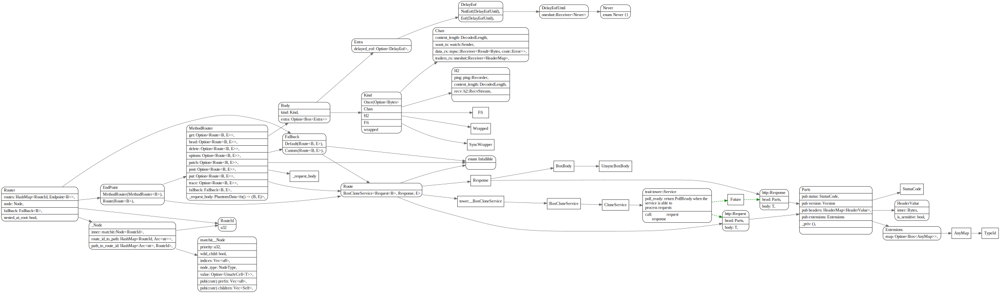
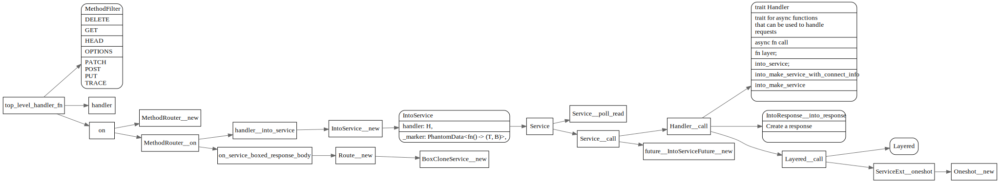
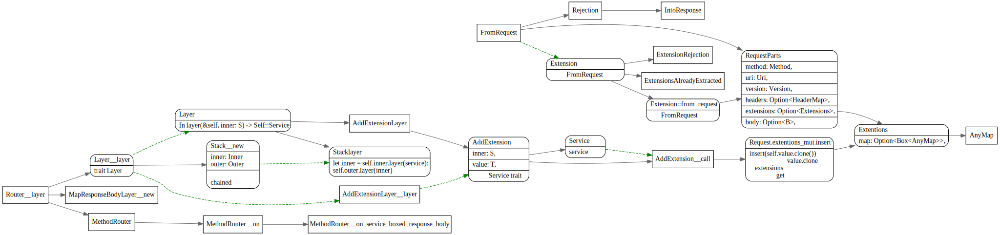

# Axum

<!-- toc -->

## DataStruct




## handlers




## Cookies


## OAuth


## Multipart


## FromRequest

```rust
#[async_trait]
pub trait FromRequest<B = crate::body::Body>: Sized {
    /// If the extractor fails it'll use this "rejection" type. A rejection is
    /// a kind of error that can be converted into a response.
    type Rejection: IntoResponse;

    /// Perform the extraction.
    async fn from_request(req: &mut RequestParts<B>) -> Result<Self, Self::Rejection>;
}
```



## Extensions

```
/// A type map of protocol extensions.
///
/// `Extensions` can be used by `Request` and `Response` to store
/// extra data derived from the underlying protocol.
#[derive(Default)]
pub struct Extensions {
    // If extensions are never used, no need to carry around an empty HashMap.
    // That's 3 words. Instead, this is only 1 word.
    map: Option<Box<AnyMap>>,
}
```

http::extentions::Extensions::get方法，根据typeid 获取对应的type.

```rust
    pub fn get<T: Send + Sync + 'static>(&self) -> Option<&T> {
        self.map
            .as_ref()
            .and_then(|map| map.get(&TypeId::of::<T>()))
            .and_then(|boxed| (&**boxed as &(dyn Any + 'static)).downcast_ref())
    }
```

## Layer

```rust
pub trait Layer<S> {
    /// The wrapped service
    type Service;
    /// Wrap the given service with the middleware, returning a new service
    /// that has been decorated with the middleware.
    fn layer(&self, inner: S) -> Self::Service;
}
```
