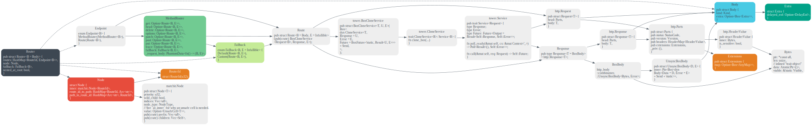
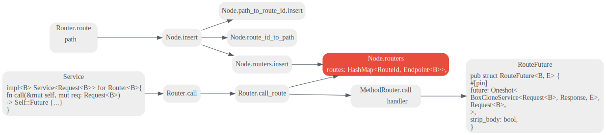
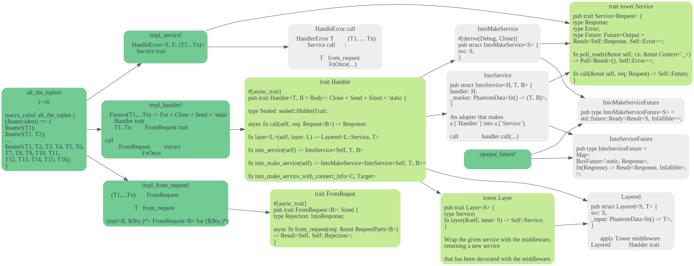
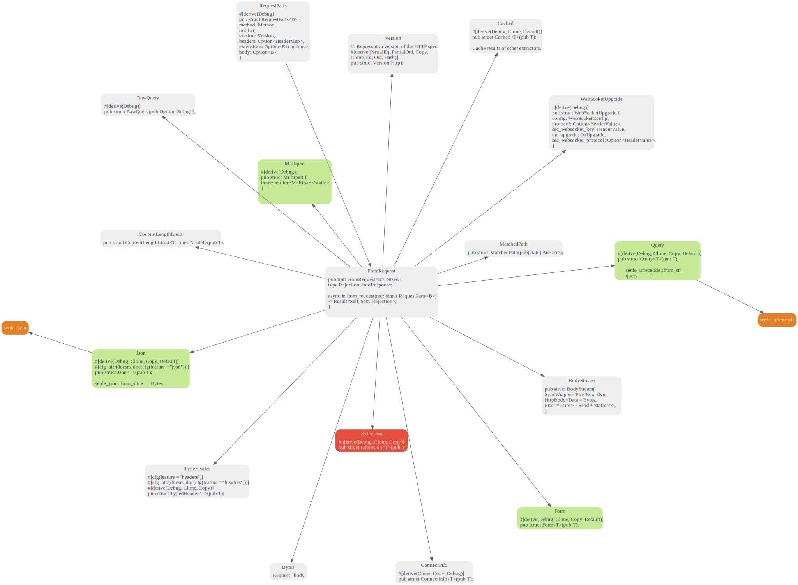
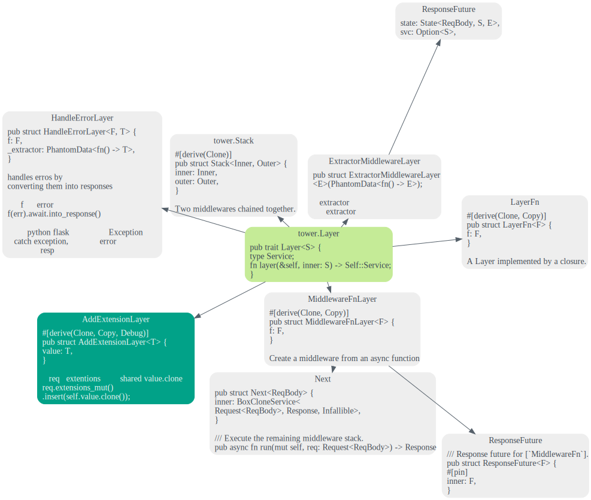
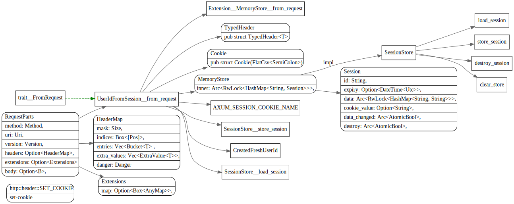
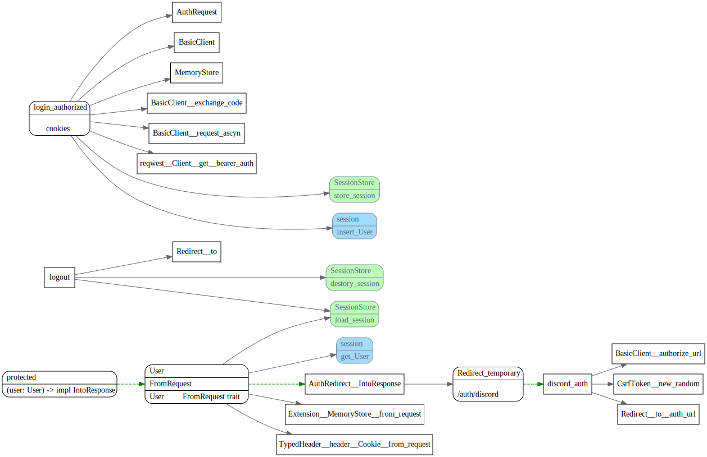
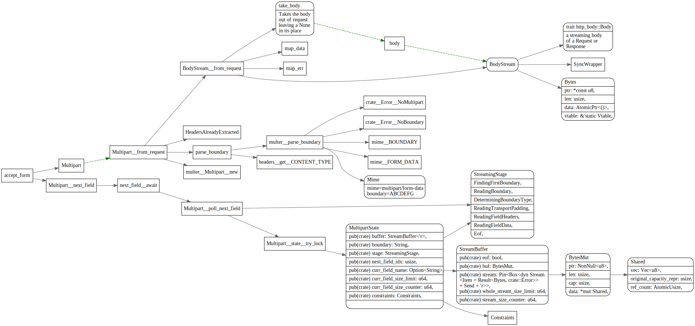

# Axum

<!-- toc -->

## Router

### Router数据结构



### 路由注册和分发




## handlers

### trait Handler
In axum a "handler" is an async function that accepts zero or more
["extractors"](crate::extract) as arguments and returns something that
can be converted [into a response](crate::response).



### extract: FromRequest

FromRequest用于将requestPart解析成各种类型，然后传个handler

```rust
#[async_trait]
pub trait FromRequest<B = crate::body::Body>: Sized {
    /// If the extractor fails it'll use this "rejection" type. A rejection is
    /// a kind of error that can be converted into a response.
    type Rejection: IntoResponse;

    /// Perform the extraction.
    async fn from_request(req: &mut RequestParts<B>) -> Result<Self, Self::Rejection>;
}
```



比较常用的有Json, Query, MatchedPath

#### Json

Json会用`serde_json::from_slice`将request body bytes解析为对应的类型，用法示例如下：

```rust
#[derive(Deserialize)]
struct CreateUser {
    email: String,
    password: String,
}

async fn create_user(extract::Json(payload): extract::Json<CreateUser>) {
    // payload is a `CreateUser`
}

let app = Router::new().route("/users", post(create_user));
# async {
# axum::Server::bind(&"".parse().unwrap()).serve(app.into_make_service()).await.unwrap();
# };
```

#### Query

Query会使用`serde_urlencoded`将query解析为相应的param, 用法示例如下:

```rust
fn app() -> Router {
    Router::new().route("/", get(handler))
}

async fn handler(Query(params): Query<Params>) -> String {
    format!("{:?}", params)
}

/// See the tests below for which combinations of `foo` and `bar` result in
/// which deserializations.
///
/// This example only shows one possible way to do this. [`serde_with`] provides
/// another way. Use which ever method works best for you.
///
/// [`serde_with`]: https://docs.rs/serde_with/1.11.0/serde_with/rust/string_empty_as_none/index.html
#[derive(Debug, Deserialize)]
#[allow(dead_code)]
struct Params {
    #[serde(default, deserialize_with = "empty_string_as_none")]
    foo: Option<i32>,
    bar: Option<String>,
}
```

#### Multipart: 文件上传

使用表单获取上传文件，其中form的`enctype='multipart/form-data'`,  并
使用ContentLengthLimit 来限制文件大小。

```rust
async fn accept_form(
    ContentLengthLimit(mut multipart): ContentLengthLimit<
        Multipart,
        {
            250 * 1024 * 1024 /* 250mb */
        },
    >,
) {
    while let Some(field) = multipart.next_field().await.unwrap() {
        let name = field.name().unwrap().to_string();
        let data = field.bytes().await.unwrap();

        println!("Length of `{}` is {} bytes", name, data.len());
    }
}

async fn show_form() -> Html<&'static str> {
    Html(
        r#"
        <!doctype html>
        <html>
            <head></head>
            <body>
                <form action="/" method="post" enctype="multipart/form-data">
                    <label>
                        Upload file:
                        <input type="file" name="file" multiple>
                    </label>

                    <input type="submit" value="Upload files">
                </form>
            </body>
        </html>
        "#,
    )
}
```


## tower.Layer

Layer 用来写中间件, Axum中提供了HandlerError中间件，可以指定一个函数，将handler的错误
转换为对应的response。ExtractorMiddleware可以将extractor转成middleware，如果extract
成功则继续执行，否则就提前返回。


```rust
pub trait Layer<S> {
    /// The wrapped service
    type Service;
    /// Wrap the given service with the middleware, returning a new service
    /// that has been decorated with the middleware.
    fn layer(&self, inner: S) -> Self::Service;
}
```



### ExtractorMiddleware

```rust
#[async_trait::async_trait]
impl<B> FromRequest<B> for RequireAuth
where
    B: Send,
{
    type Rejection = StatusCode;

    async fn from_request(req: &mut RequestParts<B>) -> Result<Self, Self::Rejection> {
        if let Some(auth) = req
            .headers()
            .expect("headers already extracted")
            .get("authorization")
            .and_then(|v| v.to_str().ok())
        {
            if auth == "secret" {
                return Ok(Self);
            }
        }

        Err(StatusCode::UNAUTHORIZED)
    }
}

async fn handler() {}

let app = Router::new().route(
    "/",
    get(handler.layer(extractor_middleware::<RequireAuth>())),
);
```

### HandleErrorLayer

HandleErrorLayer 可以使用闭包的函数将错误转换为相应的response，相应例子如下

问题：可以使用不同的HandlerErrorLayer堆在一起，每个处理自己相应类型的错误吗？
还是需要在这个地方统一来处理？

```rust
    let app = Router::new()
        .route("/todos", get(todos_index).post(todos_create))
        .route("/todos/:id", patch(todos_update).delete(todos_delete))
        // Add middleware to all routes
        .layer(
            ServiceBuilder::new()
                .layer(HandleErrorLayer::new(|error: BoxError| async move {
                    if error.is::<tower::timeout::error::Elapsed>() {
                        Ok(StatusCode::REQUEST_TIMEOUT)
                    } else {
                        Err((
                            StatusCode::INTERNAL_SERVER_ERROR,
                            format!("Unhandled internal error: {}", error),
                        ))
                    }
                }))
                .timeout(Duration::from_secs(10))
                .layer(TraceLayer::new_for_http())
                .layer(AddExtensionLayer::new(db))
                .into_inner(),
        );
```

## Response

## Extensions

```rust
/// A type map of protocol extensions.
///
/// `Extensions` can be used by `Request` and `Response` to store
/// extra data derived from the underlying protocol.
#[derive(Default)]
pub struct Extensions {
    // If extensions are never used, no need to carry around an empty HashMap.
    // That's 3 words. Instead, this is only 1 word.
    map: Option<Box<AnyMap>>,
}
```

http::extentions::Extensions::get方法，根据typeid 获取对应的type.

```rust
    pub fn get<T: Send + Sync + 'static>(&self) -> Option<&T> {
        self.map
            .as_ref()
            .and_then(|map| map.get(&TypeId::of::<T>()))
            .and_then(|boxed| (&**boxed as &(dyn Any + 'static)).downcast_ref())
    }
```


## Examples 
### Cookies



### OAuth



### Multipart



