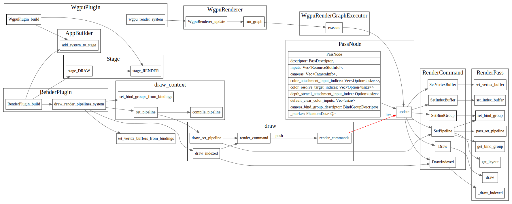

# 初次印象

<!-- toc -->
## Questions

* texture和camera是咋搞的。

## Bevy Sprite

Sprite/Sprite_sheet

了解下bevy的一个sprite是怎么画出来的

sprite的vertex/fragment shader的数据是怎么传过去的？

### shader defs

先初始化vertex shader和fragment shader

```rust
    let pipeline_handle = pipelines.add(PipelineDescriptor::default_config(ShaderStages {
        vertex: shaders.add(Shader::from_glsl(ShaderStage::Vertex, VERTEX_SHADER)),
        fragment: Some(shaders.add(Shader::from_glsl(ShaderStage::Fragment, FRAGMENT_SHADER))),
    }));
```
PipelineSpecialization

```rust
  commands
        .spawn(MeshComponents {
            mesh: cube_handle,
            render_pipelines: RenderPipelines::from_pipelines(vec![RenderPipeline::specialized(
                pipeline_handle,
                // NOTE: in the future you wont need to manually declare dynamic bindings
                PipelineSpecialization {
                    dynamic_bindings: vec![
                        // Transform
                        DynamicBinding {
                            bind_group: 1,
                            binding: 0,
                        },
                        // MyMaterial_color
                        DynamicBinding {
                            bind_group: 1,
                            binding: 1,
                        },
                    ],
                    ..Default::default()
                },
            )]),
            transform: Transform::from_translation(Vec3::new(-2.0, 0.0, 0.0)),
            ..Default::default()
```

RenderGraph的概念是咋样的

自动derive的RenderResources和ShaderDefs是啥

shadersource 貌似用的是Spirv

compile_pipeline -> compile_shader

reflect_layout 貌似这块是上传数据到shader里面的。


draw.rs中的set_bind_groups_from_bindings 

```dot
set_bind_group -> render_command 
set_index_buffer
set_vertex_buffer
SetBindGroup
set_vertex_buffers_from_bindings -> set_vertex_buffer
```

ColorMaterial 包含了color和texture

### RenderGraph
RenderGraph 是干啥的，类似于blender中的matrial node吗？

```rust
pub struct NodeState {
    pub id: NodeId,
    pub name: Option<Cow<'static, str>>,
    pub node: Box<dyn Node>,
    pub input_slots: ResourceSlots,
    pub output_slots: ResourceSlots,
    pub edges: Edges,
}
```

Slot如下
```rust
#[derive(Default, Debug, Clone)]
pub struct ResourceSlots {
    slots: Vec<ResourceSlot>,
}

#[derive(Debug, Clone)]
pub struct ResourceSlot {
    pub resource: Option<RenderResourceId>,
    pub info: ResourceSlotInfo,
}

#[derive(Clone, Debug)]
pub struct ResourceSlotInfo {
    pub name: Cow<'static, str>,
    pub resource_type: RenderResourceType,
}

#[derive(Debug, Clone, Eq, PartialEq)]
pub enum RenderResourceType {
    Buffer,
    Texture,
    Sampler,
}
```

SpriteRenderGraphBuilder
add_sprite_graph -> build_sprite_pipeline;

### Render Graph？

https://ourmachinery.com/post/high-level-rendering-using-render-graphs/

### Render Pipeline

在stage DRAW 阶段生成所有的RenderCommand,放入render_commands vec,  然后在stage Render阶段，遍历它，
执行这个render commands.



### Render Nodes

* PassNode
* CameraNode
* RenderResourcesNode
* AssetRenderResourcesNode;

#### RenderResourcesNode

RenderResourcesNode 负责绑定uniform


```rust
pub trait RenderResource {
    fn resource_type(&self) -> Option<RenderResourceType>;
    fn write_buffer_bytes(&self, buffer: &mut [u8]);
    fn buffer_byte_len(&self) -> Option<usize>;
    // TODO: consider making these panic by default, but return non-options
    fn texture(&self) -> Option<Handle<Texture>>;
}

pub trait RenderResources: Send + Sync + 'static {
    fn render_resources_len(&self) -> usize;
    fn get_render_resource(&self, index: usize) -> Option<&dyn RenderResource>;
    fn get_render_resource_name(&self, index: usize) -> Option<&str>;
    fn get_render_resource_hints(&self, _index: usize) -> Option<RenderResourceHints> {
        None
    }
    fn iter(&self) -> RenderResourceIterator;
}
```
#### derive RenderResources

derive 自动实现RenderResources接口

##### Sprite
```rust
#[derive(Debug, Default, RenderResources)]
pub struct Sprite {
    pub size: Vec2,
    #[render_resources(ignore)]
    pub resize_mode: SpriteResizeMode,
}
```

在sprite.vert中定义该uniform

``` glsl
layout(set = 2, binding = 1) uniform Sprite_size {
    vec2 size;
};
```

##### ColorMaterial

```rust
#[derive(Debug, RenderResources, ShaderDefs)]
pub struct ColorMaterial {
    pub color: Color,
    #[shader_def]
    pub texture: Option<Handle<Texture>>,
}
```


```glsl
layout(set = 1, binding = 0) uniform ColorMaterial_color {
    vec4 Color;
};

# ifdef COLORMATERIAL_TEXTURE 
layout(set = 1, binding = 1) uniform texture2D ColorMaterial_texture;
layout(set = 1, binding = 2) uniform sampler ColorMaterial_texture_sampler;
# endif
```

### TextureCopyNode

AssetEvent是由谁来emit?

监听AssetEvent，创建texture 在RendererContext中buffer

## Events

## Texture

texture 一个vec u8数据 + size + 数据格式
1. texture是怎么和shader中的buffer关联起来的?
2. texture的数据是怎么实现hot reload的？

```rust
pub struct Texture {
    pub data: Vec<u8>,
    pub size: Vec2,
    pub format: TextureFormat,
}
```

### texture_resource_system

texture_resource_system 会轮询AssetEvent, 处理AssetEvent::Created/Modified/Remove等事件


Handle是啥？

## Asset

AssetServer load相关函数，返回的都是Handle, 由channelAssetHandler加载资源，
加载完毕后，放入channel中，然后update_asset_storage_system会去设置全局
Assets和更新AssetServer中的load状态。


## PBR

## ECS

Entiy, component, system
Resources 资源

thread local 或者global的
```rust
pub struct Resources {
    pub(crate) resource_data: HashMap<TypeId, ResourceData>,
    thread_local_data: HashMap<TypeId, Box<dyn ResourceStorage>>,
    main_thread_id: ThreadId,
}
```
