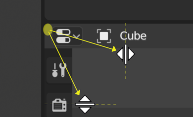

# Blender Manual notes

<!-- toc -->

## User Interface

Blender 界面分为三块

* TopBar 主要是菜单和workspace的tab
* Areas: 中间的是Areas，由各种Editor组成
* StatusBar: 最下面, 记录鼠标，键盘等状态

### StatusBar

左边记录了keymap information, 右边记录了Resource Information.

### WorkSpace

WorkSpace, 将几个editor组合起来，便于完成建模，动画等工作，

* Modeling:	For modification of geometry by modeling tools.
* Sculpting:	For modification of meshes by sculpting tools.
* UV Editing:	Mapping of image texture coordinates to 3D surfaces.
* Texture Paint:	Tools for coloring image textures in the 3D View.
* Shading:	Tools for specifying material properties for rendering.
* Animation:	Tools for making properties of objects dependent on time.
* Rendering:	For viewing and analyzing rendering results.
* Compositing:	Combining and post-processing of images and rendering information.
* Scripting:	Programming workspace for writing scripts.

### Areas

#### Split Area
鼠标放在Area左上角，出现+号时候，按住鼠标左键拖动(方向如下图所示）

#### Join Area
鼠标放在Area左上角，出现+号时候，按住鼠标左键拖动(方向和Split的相反)

#### Swap Area
两个area交换空间，鼠标放在area左上角，然后按住ctl + LMB 从src area拖动到target area

### Regions

blender 的每个editor包含不同的region.

一般Region有

* Header 
* ToolBar(快捷键T), 在编辑器左边, 当前active tool的设置
* SideBar(快捷键N)，在编辑器右边, editor中Object的settings和editor自身的settings

### Common shortcuts

## Ref
1. https://docs.blender.org/manual/en/2.80/index.html
