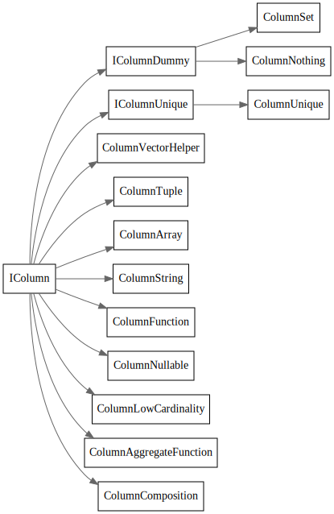

# Block

<!-- toc -->


## Block

> A Block is a container that represents a subset (chunk) of a table in memory. It is just a set of triples: (IColumn, IDataType, column name). During query execution, data is processed by Blocks. If we have a Block, we have data (in the IColumn object), we have information about its type (in IDataType) that tells us how to deal with that column, and we have the column name. It could be either the original column name from the table or some artificial name assigned for getting temporary results of calculations.

最基本的数据处理单元, 有点类似于Pandas的dataframe, 对应的基本操作有insert/erase

```cpp
/** Container for set of columns for bunch of rows in memory.
  * This is unit of data processing.
  * Also contains metadata - data types of columns and their names
  *  (either original names from a table, or generated names during temporary calculations).
  * Allows to insert, remove columns in arbitrary position, to change order of columns.
  */
```


## BlockInfo

```cpp
    /** is_overflows:
      * After running GROUP BY ... WITH TOTALS with the max_rows_to_group_by and group_by_overflow_mode = 'any' settings,
      *  a row is inserted in the separate block with aggregated values that have not passed max_rows_to_group_by.
      * If it is such a block, then is_overflows is set to true for it.
      */

    /** bucket_num:
      * When using the two-level aggregation method, data with different key groups are scattered across different buckets.
      * In this case, the bucket number is indicated here. It is used to optimize the merge for distributed aggregation.
      * Otherwise -1.
      */
```

## IColumn

Cow: Copy on write shared Ptr

ICoumn存储数据

icolumn和idatatype 比较类似？他们两者分别负责什么功能?



## IDataType

数据的序列化和反序列化


