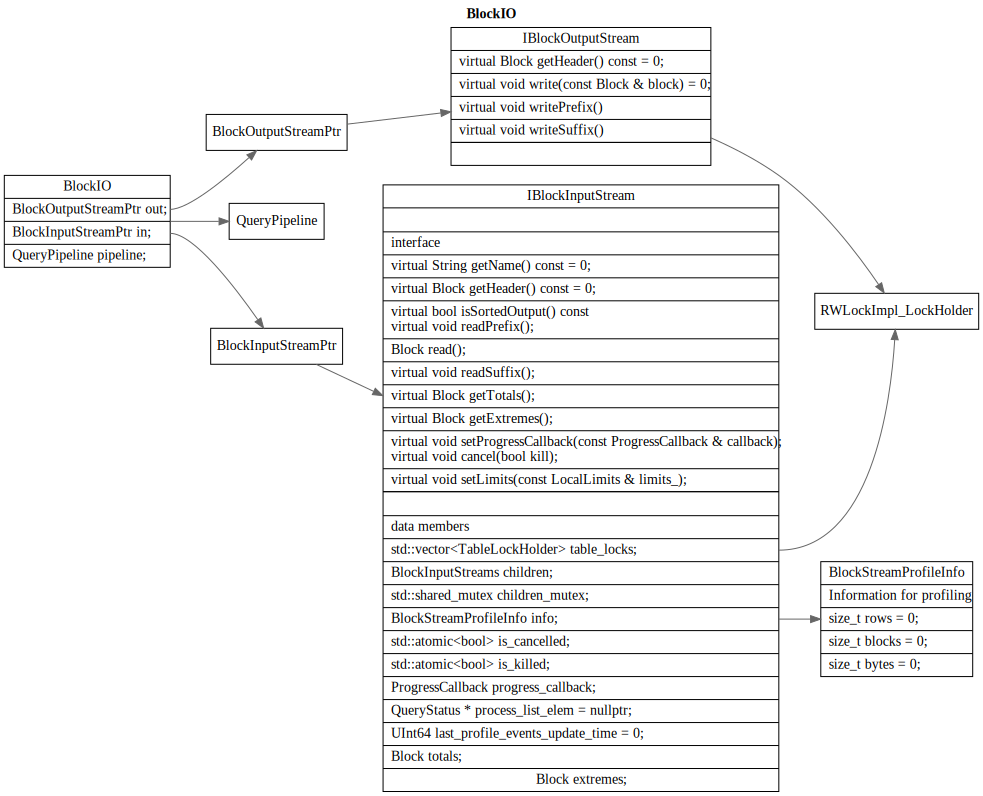
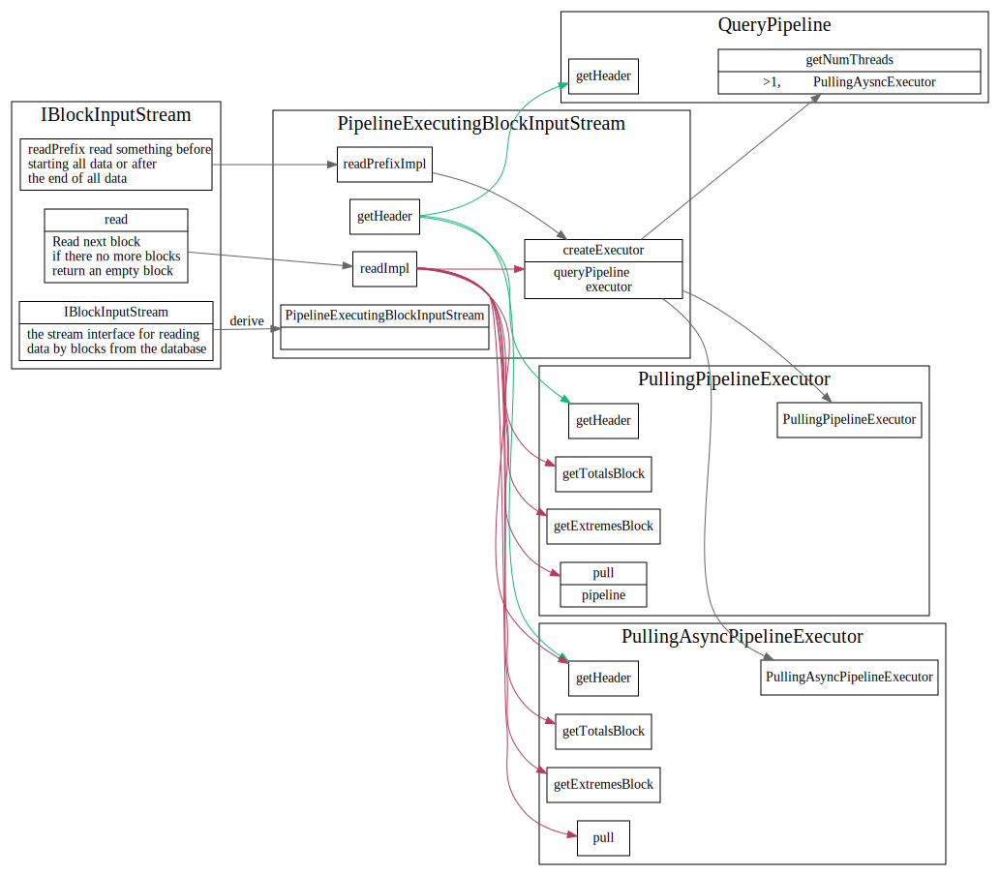

# BlockIO

<!-- toc -->

Block的输入输出, 主要有BlockInputStream 和
BlockOutputStream, 输入输出的基本单位为Block

getHeader header的作用是啥？表明data的schema吗?

## IBlockInputStream

> The stream interface for reading data by blocks from the database.
> Relational operations are supposed to be done also as implementations of this interface.
> Watches out at how the source of the blocks works.
> Lets you get information for profiling: rows per second, blocks per second, megabytes per second, etc.
> Allows you to stop reading data (in nested sources).

IBlockInputStream 主要接口 read, readPrefix, readSuffix

这个地方的limit, quta, 以及info之类的作用是什么?

### IBlockInputStream 继承关系

#### AsynchronousBlockInputStream

> Executes another BlockInputStream in a separate thread.
> This serves two purposes:
> 1. Allows you to make the different stages of the query execution pipeline work in parallel.
> 2. Allows you not to wait until the data is ready, and periodically check their readiness without blocking.
>    This is necessary, for example, so that during the waiting period you can check if a packet
>     has come over the network with a request to interrupt the execution of the query.
>    It also allows you to execute multiple queries at the same time.

#### PipelineExecutingBlockInputStream

> Implement IBlockInputStream from QueryPipeline.
> It's a temporary wrapper.

TODO:
1. TypePromotion 模板
2. Cow 模板

## IBlockOutputStream

> Interface of stream for writing data (into table, filesystem, network, terminal, etc.)

