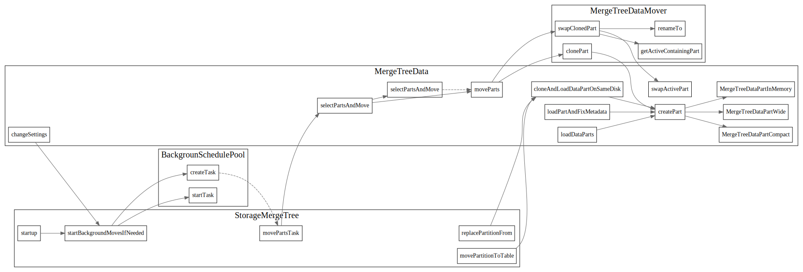

# MergeTreeData

<!-- toc -->

```
> Data structure for *MergeTree engines.
> Merge tree is used for incremental sorting of data.
> The table consists of several sorted parts.
> During insertion new data is sorted according to the primary key and is written to the new part.
> Parts are merged in the background according to a heuristic algorithm.
> For each part the index file is created containing primary key values for every n-th row.
> This allows efficient selection by primary key range predicate.
```

数据是根据primary key排序的，新插入的数据，被写到一个新的part中，然后由
后台线程根据启发式算法将parts merge合并起来。

## MergeTreeData file struct


## MergeTreeData Struct


### StorageInMemoryMetadata

### data_parts_indexes

使用了boost的multi_index 用来根据快速定位到DataPart

```cpp
using DataPartsIndexes = boost::multi_index_container<DataPartPtr,
    boost::multi_index::indexed_by<
        /// Index by Info
        boost::multi_index::ordered_unique<
            boost::multi_index::tag<TagByInfo>,
            boost::multi_index::global_fun<const DataPartPtr &, const MergeTreePartInfo &, dataPartPtrToInfo>
        >,
        /// Index by (State, Info), is used to obtain ordered slices of parts with the same state
        boost::multi_index::ordered_unique<
            boost::multi_index::tag<TagByStateAndInfo>,
            boost::multi_index::global_fun<const DataPartPtr &, DataPartStateAndInfo, dataPartPtrToStateAndInfo>,
            LessStateDataPart
        >
    >
>;
```

围绕data_parts_index的insert/erase和查询


MergeTreeData 的数据成员
```cpp
    bool require_part_metadata;
    String relative_data_path;
    /// Current column sizes in compressed and uncompressed form.
    ColumnSizeByName column_sizes;
    /// Engine-specific methods
    BrokenPartCallback broken_part_callback;
    String log_name;
    Poco::Logger * log;
    /// Storage settings.
    /// Use get and set to receive readonly versions.
    MultiVersion<MergeTreeSettings> storage_settings;

    mutable std::mutex data_parts_mutex;
    DataPartsIndexes data_parts_indexes;
    DataPartsIndexes::index<TagByInfo>::type & data_parts_by_info;
    DataPartsIndexes::index<TagByStateAndInfo>::type & data_parts_by_state_and_info;

    MergeTreePartsMover parts_mover;
```

### create

```cpp
    /// Create part, that already exists on filesystem.
    /// After this methods 'loadColumnsChecksumsIndexes' must be called.
    MutableDataPartPtr createPart(const String & name,
        const VolumePtr & volume, const String & relative_path) const;
```

call create的调用链



### loadDataParts


## MergeTreeDataWriter

### writeTempPart 

对block数据排序，然后写到MergeTreeDataPart中，


### IMergeTreeDataPartWriter

### MergeTreeDataPartWriterOnDisk

### `MergeTreeDataPartWriterOnDisk::Stream` 

负责将数据写入到存储介质中

```cpp
    /// Helper class, which holds chain of buffers to write data file with marks.
    /// It is used to write: one column, skip index or all columns (in compact format).
    struct Stream
    {
        Stream(
            const String & escaped_column_name_,
            DiskPtr disk_,
            const String & data_path_,
            const std::string & data_file_extension_,
            const std::string & marks_path_,
            const std::string & marks_file_extension_,
            const CompressionCodecPtr & compression_codec_,
            size_t max_compress_block_size_,
            size_t estimated_size_,
            size_t aio_threshold_);

        String escaped_column_name;
        std::string data_file_extension;
        std::string marks_file_extension;

        /// compressed -> compressed_buf -> plain_hashing -> plain_file
        std::unique_ptr<WriteBufferFromFileBase> plain_file;
        HashingWriteBuffer plain_hashing;
        CompressedWriteBuffer compressed_buf;
        HashingWriteBuffer compressed;

        /// marks -> marks_file
        std::unique_ptr<WriteBufferFromFileBase> marks_file;
        HashingWriteBuffer marks;

        void finalize();

        void sync() const;

        void addToChecksums(IMergeTreeDataPart::Checksums & checksums);
    };
```

stream负责将数据写入磁盘(s3), 这里面要提到WriteBuffer

```
MergetreeData -> MergetTreeDataPart -> partWriter -> stream -> writeBuffer
```


#### MergeTreeDataPartWriterCompact

所有的column写在一起


#### MergeTreeDataPartWriterWide

每个column有自己的.bin和.mrk文件

#### MergeTreeDataPartWriterInMemory


## IMergeTreeDataPart

### state
```cpp
enum class State
{
    Temporary,       /// the part is generating now, it is not in data_parts list
    PreCommitted,    /// the part is in data_parts, but not used for SELECTs
    Committed,       /// active data part, used by current and upcoming SELECTs
    Outdated,        /// not active data part, but could be used by only current SELECTs, could be deleted after SELECTs finishes
    Deleting,        /// not active data part with identity refcounter, it is deleting right now by a cleaner
    DeleteOnDestroy, /// part was moved to another disk and should be deleted in own destructor
};
```

### reader/writer interface


IMergeTreeDataPart 封装了getReader和getWriter分别用于part的读写
```cpp
    virtual MergeTreeReaderPtr getReader(
        const NamesAndTypesList & columns_,
        const StorageMetadataPtr & metadata_snapshot,
        const MarkRanges & mark_ranges,
        UncompressedCache * uncompressed_cache,
        MarkCache * mark_cache,
        const MergeTreeReaderSettings & reader_settings_,
        const ValueSizeMap & avg_value_size_hints_ = ValueSizeMap{},
        const ReadBufferFromFileBase::ProfileCallback & profile_callback_ = ReadBufferFromFileBase::ProfileCallback{}) const = 0;

    virtual MergeTreeWriterPtr getWriter(
        const NamesAndTypesList & columns_list,
        const StorageMetadataPtr & metadata_snapshot,
        const std::vector<MergeTreeIndexPtr> & indices_to_recalc,
        const CompressionCodecPtr & default_codec_,
        const MergeTreeWriterSettings & writer_settings,
        const MergeTreeIndexGranularity & computed_index_granularity = {}) const = 0;
```

### MergeTreeDataPartWide

```cpp
/** In wide format data of each column is stored in one or several (for complex types) files.
  * Every data file is followed by marks file.
  * Can be used in tables with both adaptive and non-adaptive granularity.
  * This is the regular format of parts for MergeTree and suitable for big parts, as it's the most efficient.
  * Data part would be created in wide format if it's uncompressed size in bytes or number of rows would exceed
  * thresholds `min_bytes_for_wide_part` and `min_rows_for_wide_part`.
  */ 
```

### MergeTreeDataPartCompact
### MergeTreeDataPartInMemory

### MergeTreeDataPartWriterWide

没有看明白，哪个地方是写数据到disk里中的。


## 其他杂项TODO

### WriteBuffer
write buffer派生


