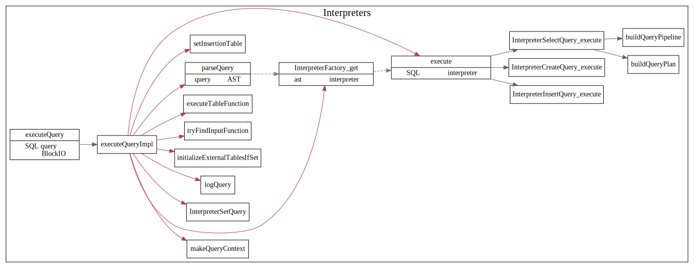
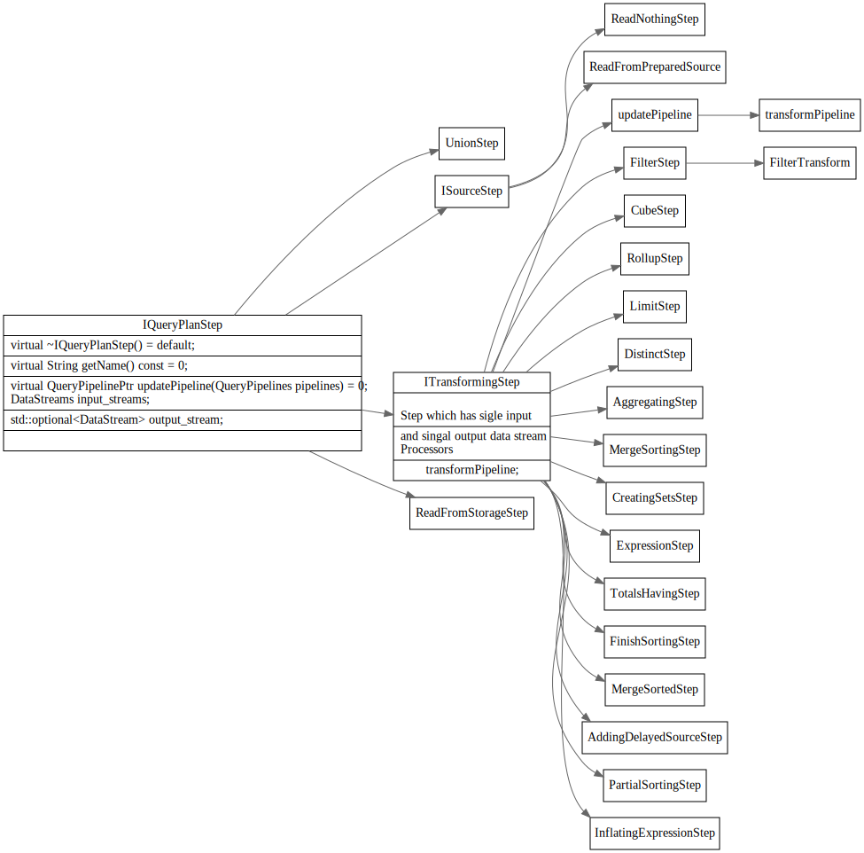
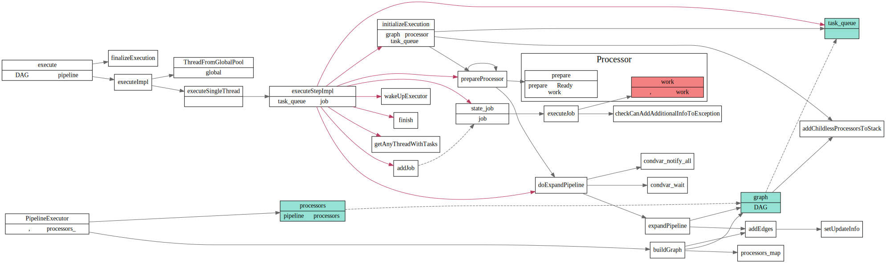
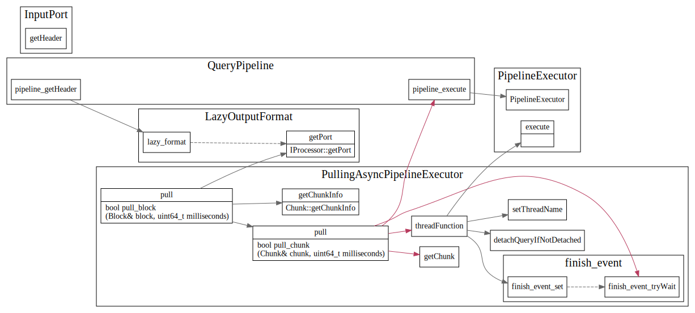
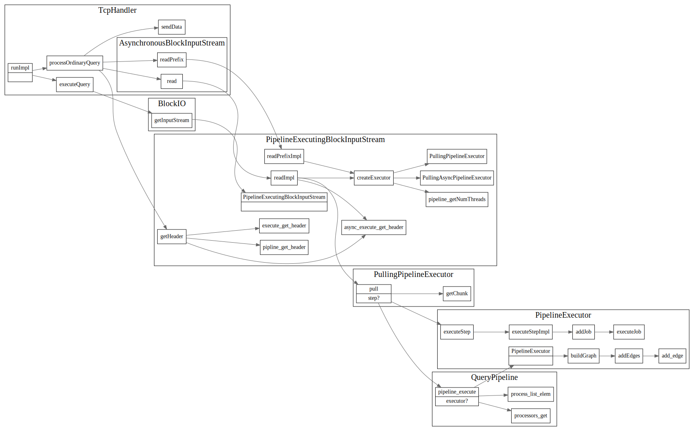

# Server Main 

<!-- toc -->

## Server main 主流程

### 主循环

首先监听端口号，等待客户端连接， 
和客户端建立连接后,server然后不断从conn中读取packet, 
解析sql语句为AST树，然后创建plan pipeline
最后执行plan，将result set通过网络发送给客户端.


### SQL 解析执行流程

一条Query SQL在clickhouse中执行流程如下:


#### Parse SQL

解析SQL，解析为AST树，然后创建对应的pipeline plan.



#### SelectQuery  

执行Select Query , 创建QueryPlan


#### QueryPlanStep



#### IProcessor 

 Processor is an element (low level building block) of a query execution pipeline.
It has zero or more input ports and zero or more output ports.

Blocks of data are transferred over ports.
Each port has fixed structure: names and types of columns and values of constants.

```
src/Processors/IProcessor.h
```

#### IProcessor 继承关系图

CK中Iprocessor的继承关系图

```cpp
class IProcessor
{
protected:
    InputPorts inputs;
    OutputPorts outputs;
}
```


### Executor: 执行pipeline

#### PipelineExecutor

使用线程池执行pipline




#### PullingPipelineExecutor

单线程同步执行？

```cpp
/// Pulling executor for QueryPipeline. Always execute pipeline in single thread.
/// Typical usage is:
///
/// PullingPipelineExecutor executor(query_pipeline);
/// while (executor.pull(chunk))
///     ... process chunk ...
```


#### PullingAsyncPipelineExecutor

多线程异步执行


```cpp
/// Asynchronous pulling executor for QueryPipeline.
/// Always creates extra thread. If query is executed in single thread, use PullingPipelineExecutor.
/// Typical usage is:
///
/// PullingAsyncPipelineExecutor executor(query_pipeline);
/// while (executor.pull(chunk, timeout))
///     ... process chunk ...
```




### BlockIO
block-io getInputStream，读数据时执行plan



## Ref

1. [Clickhouse源码导读: 网络IO](https://cloud.tencent.com/developer/article/1602664)
2. [Clickhouse源码导读](http://sineyuan.github.io/post/clickhouse-source-guide/)

