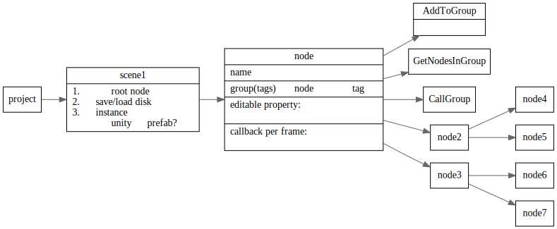
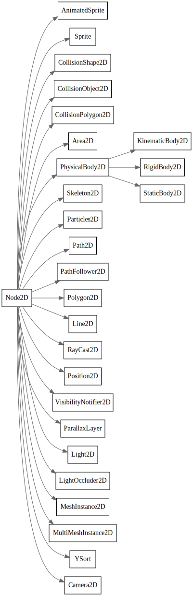
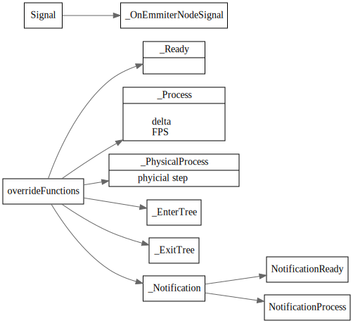

# godot 学习笔记

<!-- toc -->

## node tree
1. 在tree中怎么快速定位到某个Node? 并转换为相应类型？
2. node之间怎么互相调用？
3. scene之间的过渡场景怎么搞？
4. 目前有哪些node 各自负责干啥？



## Node2D



## Node 虚函数

Rust中没有虚函数，是咋搞的

```c#
public override void _EnterTree()
{
    // When the node enters the Scene Tree, it becomes active
    // and  this function is called. Children nodes have not entered
    // the active scene yet. In general, it's better to use _ready()
    // for most cases.
    base._EnterTree();
}

public override void _Ready()
{
    // This function is called after _enter_tree, but it ensures
    // that all children nodes have also entered the Scene Tree,
    // and became active.
    base._Ready();
}

public override void _ExitTree()
{
    // When the node exits the Scene Tree, this function is called.
    // Children nodes have all exited the Scene Tree at this point
    // and all became inactive.
    base._ExitTree();
}

public override void _Process(float delta)
{
    // This function is called every frame.
    base._Process(delta);
}

public override void _PhysicsProcess(float delta)
{
    // This is called every physics frame.
    base._PhysicsProcess(delta);
}
```



## Instance Scene

先load scene, 然后将scene instance为node，可以放在场景里面
```
var scene = GD.Load<PackedScene>("res://myscene.tscn"); // Will load when the script is instanced.

//preload
var scene = preload("res://myscene.tscn") # Will load when parsing the script.

//instance
var node = scene.Instance();
AddChild(node);
```

## Signal

可以在editor中connect. 也可以在代码中connect 信号和handler 

### Connect signal
```
extends Node2D


func _ready():
    $Timer.connect("timeout", self, "_on_Timer_timeout")


func _on_Timer_timeout():
    $Sprite.visible = !$Sprite.visible
```

### Emit signal

定义和发射signal
```
extends Node2D


signal my_signal


func _ready():
    emit_signal("my_signal")
```
