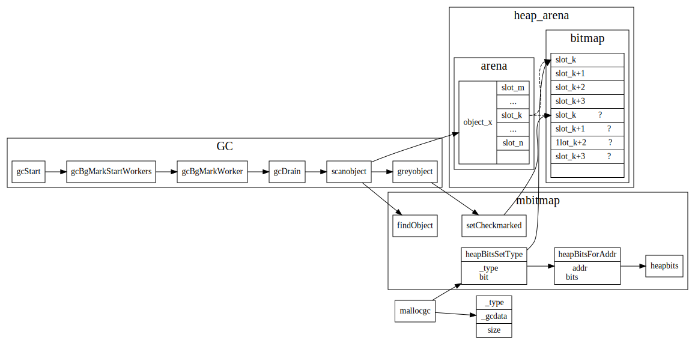

# GC

## GcPhase

1. `_GCoff`:  GC not running; sweeping in background, write barrier disabled
2. `_GCmark`: GC marking roots and workbufs: allocate black, write barrier ENABLED
3. `_GCmarktermination`: GC mark termination: allocate black, P's help GC, write barrier ENABLED

如下图所示，GC过程中开启了两次STW(stop the world),　第一次主要为parepare阶段，
第二次为Marktermination阶段:


```go
//go:nosplit
func setGCPhase(x uint32) {
	atomic.Store(&gcphase, x)
	writeBarrier.needed = gcphase == _GCmark || gcphase == _GCmarktermination
	writeBarrier.enabled = writeBarrier.needed || writeBarrier.cgo
}
```

## Mark Phase

Golang中是如何根据指针找到对象，以及该对象所引用的对象的？答案是根据heap Arena中bitmap存储的元信息。
对于Arena中每个word, bitmap使用了两个bit，来标识该word是否是指针，以及该word是否已被扫描过。

```go
type heapArena struct {
	// bitmap stores the pointer/scalar bitmap for the words in
  // this arena
	bitmap [heapArenaBitmapBytes]byte
	spans [pagesPerArena]*mspan
	pageInUse [pagesPerArena / 8]uint8
	pageMarks [pagesPerArena / 8]uint8
	zeroedBase uintptr
}
```


