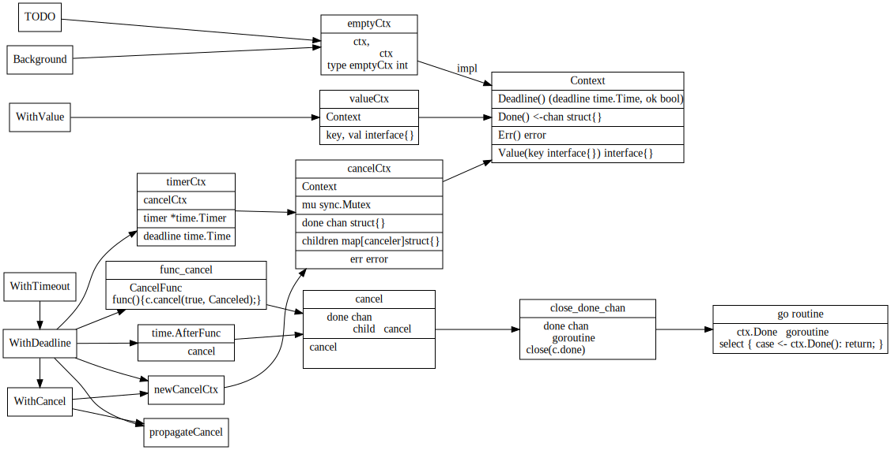

# Context

### Context struct之间关系



### Context example

```go
// This example demonstrates the use of a cancelable context to prevent a
// goroutine leak. By the end of the example function, the goroutine started
// by gen will return without leaking.
func ExampleWithCancel() {
	// gen generates integers in a separate goroutine and
	// sends them to the returned channel.
	// The callers of gen need to cancel the context once
	// they are done consuming generated integers not to leak
	// the internal goroutine started by gen.
	gen := func(ctx context.Context) <-chan int {
		dst := make(chan int)
		n := 1
		go func() {
			for {
				select {
				case <-ctx.Done():
					return // returning not to leak the goroutine
				case dst <- n:
					n++
				}
			}
		}()
		return dst
	}

	ctx, cancel := context.WithCancel(context.Background())
	defer cancel() // cancel when we are finished consuming integers

	for n := range gen(ctx) {
		fmt.Println(n)
		if n == 5 {
			break
		}
	}
	// Output:
	// 1
	// 2
	// 3
	// 4
	// 5
}
```
