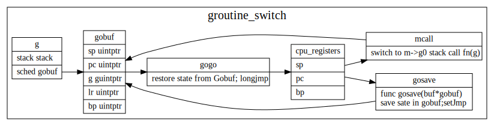

# Goroutine Stack

## goroutine switch



### mcall

mcall 保存被切换gorutine信息，并在当前线程g0 goroutine上执行新的func


```
// func mcall(fn func(*g))
// Switch to m->g0's stack, call fn(g).
// Fn must never return. It should gogo(&g->sched)
// to keep running g.
TEXT runtime·mcall(SB), NOSPLIT, $0-8
	MOVQ	fn+0(FP), DI

	get_tls(CX)
	MOVQ	g(CX), AX	// save state in g->sched
	MOVQ	0(SP), BX	// caller's PC
	MOVQ	BX, (g_sched+gobuf_pc)(AX)
	LEAQ	fn+0(FP), BX	// caller's SP
	MOVQ	BX, (g_sched+gobuf_sp)(AX)
	MOVQ	AX, (g_sched+gobuf_g)(AX)
	MOVQ	BP, (g_sched+gobuf_bp)(AX)

	// switch to m->g0 & its stack, call fn
	MOVQ	g(CX), BX
	MOVQ	g_m(BX), BX
	MOVQ	m_g0(BX), SI
	CMPQ	SI, AX	// if g == m->g0 call badmcall
	JNE	3(PC)
	MOVQ	$runtime·badmcall(SB), AX
	JMP	AX
	MOVQ	SI, g(CX)	// g = m->g0
	MOVQ	(g_sched+gobuf_sp)(SI), SP	// sp = m->g0->sched.sp
	PUSHQ	AX
	MOVQ	DI, DX
	MOVQ	0(DI), DI
	CALL	DI
	POPQ	AX
	MOVQ	$runtime·badmcall2(SB), AX
	JMP	AX
	RET
```

### gogo

gogo 用来从gobuf中恢复协程执行状态，并跳转到上一次指令处继续执行

```go
// func gogo(buf *gobuf)
// restore state from Gobuf; longjmp
TEXT runtime·gogo(SB), NOSPLIT, $16-8
	MOVQ	buf+0(FP), BX		// gobuf
	MOVQ	gobuf_g(BX), DX
	MOVQ	0(DX), CX		// make sure g != nil
	get_tls(CX)
	MOVQ	DX, g(CX)
	MOVQ	gobuf_sp(BX), SP	// restore SP
	MOVQ	gobuf_ret(BX), AX
	MOVQ	gobuf_ctxt(BX), DX
	MOVQ	gobuf_bp(BX), BP
	MOVQ	$0, gobuf_sp(BX)	// clear to help garbage collector
	MOVQ	$0, gobuf_ret(BX)
	MOVQ	$0, gobuf_ctxt(BX)
	MOVQ	$0, gobuf_bp(BX)
	MOVQ	gobuf_pc(BX), BX
	JMP	BX
```

### gosave
gosave感觉和cgo相关，这个代码还没怎么搞明白


```
// func gosave(buf *gobuf)
// save state in Gobuf; setjmp
TEXT runtime·gosave(SB), NOSPLIT, $0-8
	MOVQ	buf+0(FP), AX		// gobuf
	LEAQ	buf+0(FP), BX		// caller's SP
	MOVQ	BX, gobuf_sp(AX)
	MOVQ	0(SP), BX		// caller's PC
	MOVQ	BX, gobuf_pc(AX)
	MOVQ	$0, gobuf_ret(AX)
	MOVQ	BP, gobuf_bp(AX)
	// Assert ctxt is zero. See func save.
	MOVQ	gobuf_ctxt(AX), BX
	TESTQ	BX, BX
	JZ	2(PC)
	CALL	runtime·badctxt(SB)
	get_tls(CX)
	MOVQ	g(CX), BX
	MOVQ	BX, gobuf_g(AX)
	RET
```

## Stack增长

编译器在每个函数调用中都会插入对morestack的调用。

morestack会检查当前栈空间是否够用，不够用的话，会调用newstack增长空间.
newstack 会分配2倍大小的stack, copy过去, 并将指向该stack的引用指针也修改过去。


