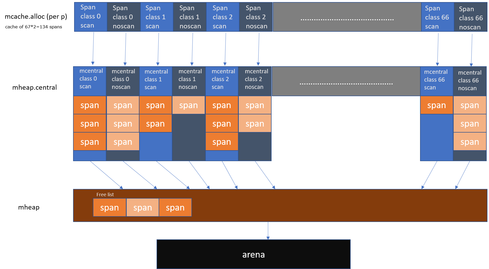

# Memory分配

## struct之间引用关系


```go
//src/runtime/malloc.go
//	fixalloc: a free-list allocator for fixed-size off-heap objects,
//		used to manage storage used by the allocator.
//	mheap: the malloc heap, managed at page (8192-byte) granularity.
//	mspan: a run of in-use pages managed by the mheap.
//	mcentral: collects all spans of a given size class.
//	mcache: a per-P cache of mspans with free space.
//	mstats: allocation statistics.
```
1. fixalloc 用于分配mspan等固定大小的object
2. mheap 用于8KB page粒度内存管理
3. mspan: 一段连续的pages,用于分配制定specClass的object.
4. mcentral: 所有span的list
5. mcache: 线程的span cache, 优先从cache中分配, 避免每次访问heap需要lock.


下图摘自[1](blog.learngoprogramming.com/a-visual-guide-to-golang-memory-allocator-from-ground-up-e132258453ed)
比较清楚的画出了这几者之间的层级关系



## mspan

mspan的创建路径如下


## Ref

1. [A visual guide to Go Memory Allocator from scratch](https://blog.learngoprogramming.com/a-visual-guide-to-golang-memory-allocator-from-ground-up-e132258453ed)
