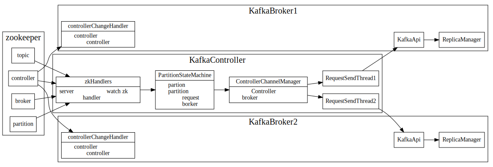
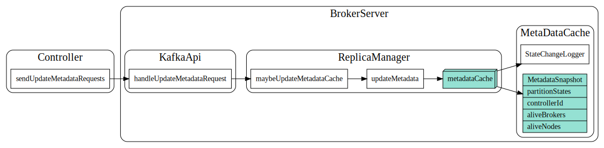
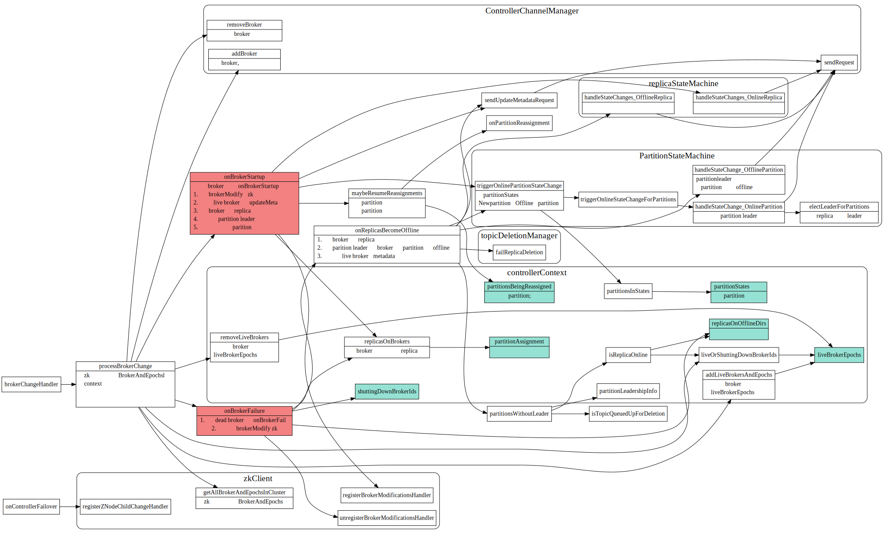
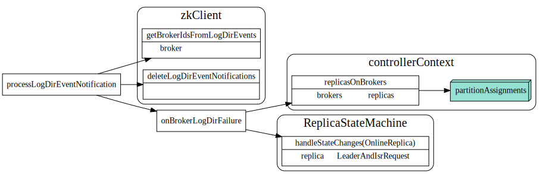
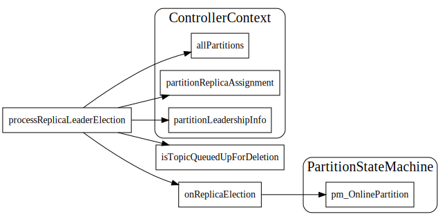
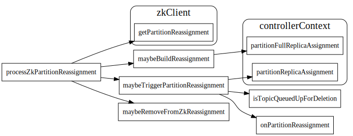

# Kafka Controller

## Controller 作用

kafka中会从broker server中选取一个作为controller，该controller通过ControllerChannelManager管理和每个broker通信的线程。

当zk中broker,topic, partion 等发生变动时，controller向每个broker发送消息, replica和partition 主要是通过replicaStateMachine和PartitionStateMachine来管理的
当replica或者partition leaderAndISR信息发生变动时候，controller通过这两个状态机，将状态的转换改为
相应的request请求，发送给broker。 

其中比较重要的请求是LeaderAndISR, 它指定了partition的leader和paritition in sync的replica list。

每个broker在zk中注册了ControllerChangeHandler，如果controller挂了，broker就会尝试去选举新的controller.

controller和broker之间同步metadata

controller和broker之间处理IsrAndLeader请求

## Controller 选举

每个kafka broker启动后, 会去zk中尝试创建ControllerZNode, 如果成功就会当选为controller。然后调用`onControllerFailover`开始controller的工作

 * 从zk中加载数据，刷新controllerContext中的各种cache.
 * 在zk中注册broker, topic, patition等zk处理函数.
 * 启动channelManager, 建立和其他broker之间通信channel
 * 启动PartitionStateMachine和ReplicaStateMachine管理分区和副本状态.
 * 启动kafkaScheduler，启动后台调度等

## ControllerFailOver

### Controller注册的zk回调函数

#### Broker

`BrokerChangeHandler`, 处理broker上线下线

`BrokerModificationsHandler` 处理broker信息变化

#### Topic

topic change

topic delete

#### Isrchange

主要更新controller中的cache，并且controller发送sendUpdateMetadata通知所有的borker更新metadata.

#### LogDirEvent

#### ReplicaLeaderElection

#### PartitionReassignment

