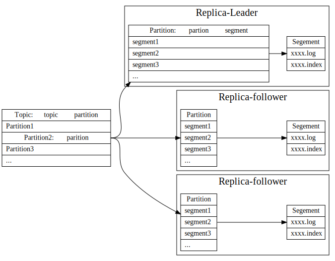
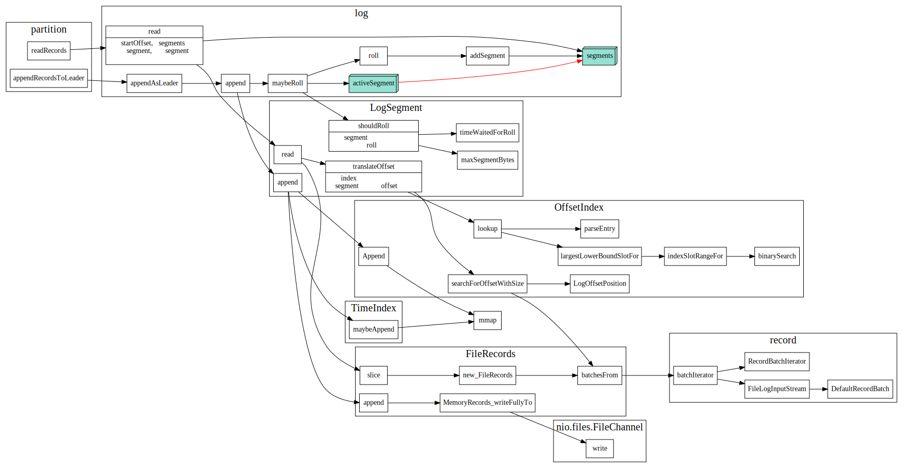
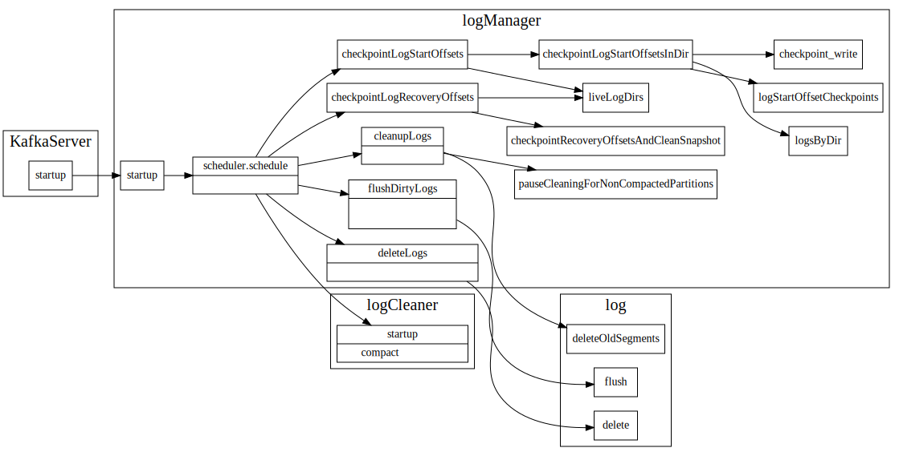

# Kafka LogManager

## Kafka日志层级

在kafka中每个topic可以有多个partition,　每个partition存储时候分为多个segment。

每个parition有多个副本，副本分布在不同的broker上，其中一个broker被选为该partition的leader,
消息是写到kafka partition leader副本中的，而follower通过fetchmessage，同步该partition的消息。

## 日志文件加载和创建

## 日志读写

## 日志清理和压缩

