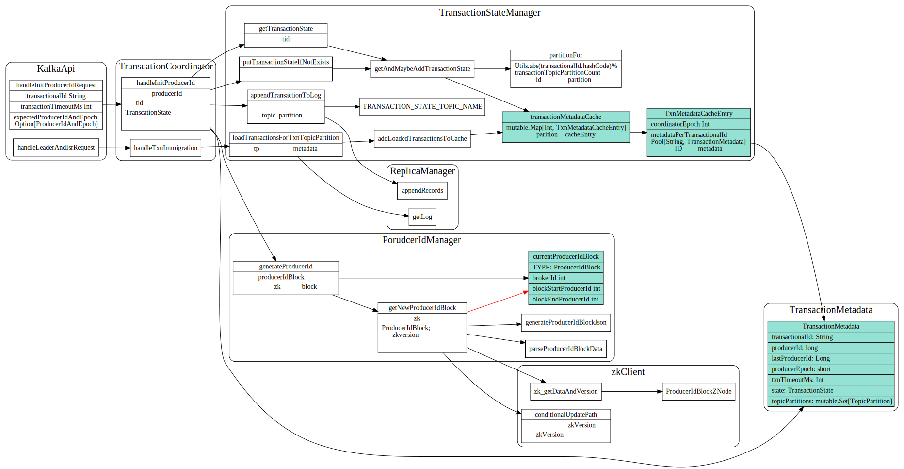
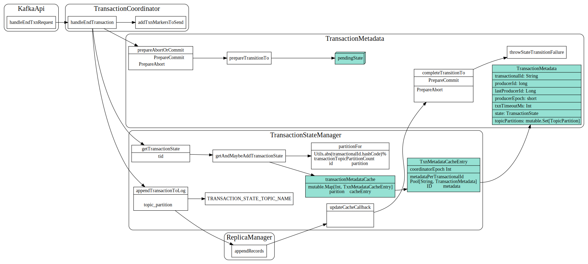
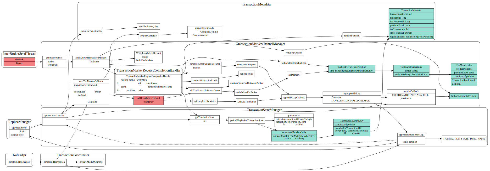
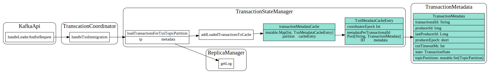

# Txn coordinator

kafka streams中实现exactly once处理

事务日志中消息格式, 启动了log compaction

```
/* Producer TransactionalId mapping message */
Key => Version TransactionalId  
  Version => 0 (int16)
  TransactionalId => String
Value => Version ProducerId ProducerEpoch TxnTimeoutDuration TxnStatus [TxnPartitions] TxnEntryLastUpdateTime TxnStartTime
  Version => 0 (int16)
  ProducerId => int64
  ProducerEpoch => int16
  TxnTimeoutDuration => int32
  TxnStatus => int8
  TxnPartitions => [Topic [Partition]]
     Topic => String
     Partition => int32
  TxnLastUpdateTime => int64
  TxnStartTime => int64
```

## FindCoordinator

partition的leader为txn的coordinator


## InitProducerId

生成全局唯一producerId, 每个transactionId对应着一个TransactionMetadata,
其中的topicPartitions 该事务涉及到的topic partition set.




## AddPartitionsToTxn

向事务添加Partitions


## endTxn

于commitTransaction方法，它会在发送EndTxnRequest之前先调用flush方法以确保所有发送出去的数据都得到相应的ACK。对于abortTransaction方法，在发送EndTxnRequest之前直接将当前Buffer中的事务性消息（如果有）全部丢弃，但必须等待所有被发送但尚未收到ACK的消息发送完成。

### 准备阶段：PrepareCommit/PrepareAbort

将prepareCommit/PrepareAbort写入日志中, 写成功之后，coordinator会保证事务一定会被commit或者abort.




### 提交阶段

prepareCommit/preapreAbort日志写入成功后调用`sendTxnMarkersCallback`, coordinator 向事务中涉及到的broker发送WriteTxnMarker 请求，coordinator会一直尝试发送直到成功。
所有broker都响应成功后，会写入日志，并迁移到complete状态。



### broker对WriteMarkers请求的处理


## TxnImmigration



## Ref

1.[Transactions in Apache Kafka](https://www.confluent.io/blog/transactions-apache-kafka/)
2.[Kafka设计解析8](https://cloud.tencent.com/developer/article/1149669)
3.[Transactional Messaging in Kafka](https://cwiki.apache.org/confluence/display/KAFKA/Transactional+Messaging+in+Kafka)
4.[Exactly Once Delivery and Transactional Messaging in Kafka](https://docs.google.com/document/d/11Jqy_GjUGtdXJK94XGsEIK7CP1SnQGdp2eF0wSw9ra8/edit#heading=h.i4ub5zye01nh)
