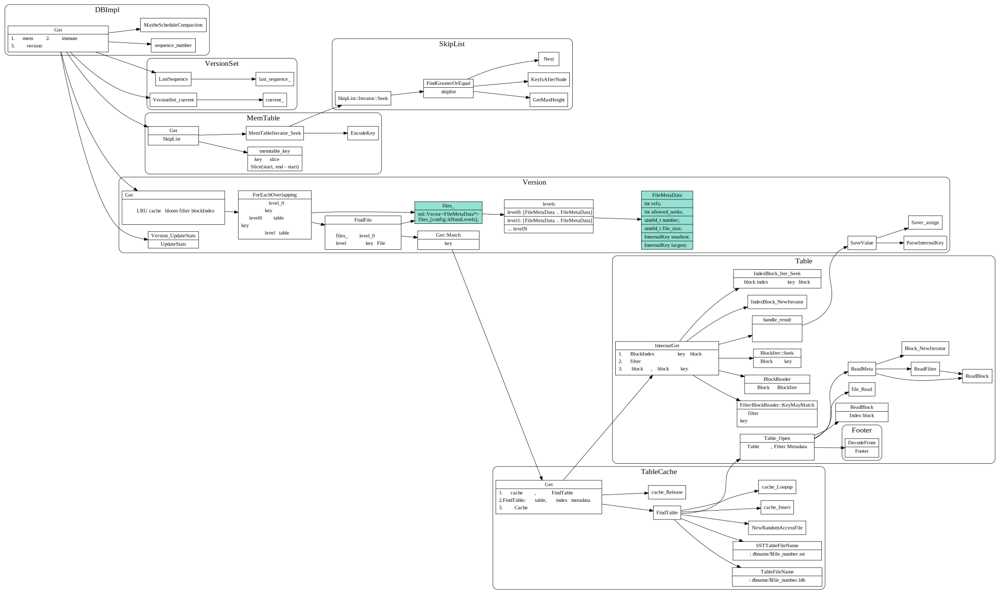
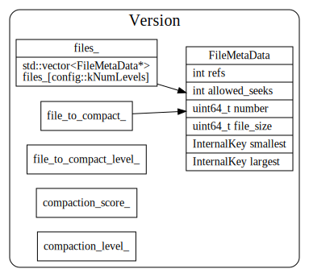

# Draft

### 数据结构之间引用关系

1. Cache
2. Table
3. VersionSet
4. Env

### DB Get

### DB Put

### DB Compact

### Table builder

memtable写入文件过程

table format

1. restart point的作用是啥？

## VersionSet

### Manifest文件

### VersionEdit

## TODO:
## WAL日志
## Iterator
## Bloom Filter

## Ref
1. [table format](https://github.com/google/leveldb/blob/master/doc/table_format.md)
2. [LevelDB设计与实现 - 读写流程](https://zhuanlan.zhihu.com/p/51360281)
