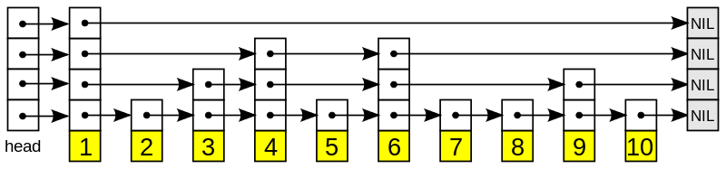

# leveldb

记录一些学习leveldb源码笔记

```
https://github.com/google/leveldb
```

## struct and alg

### skiplist

skiplist 应用的非常广泛，O(log n)的查找复杂度, O(log n)的查找复杂度, 下图是wiki上找到的示意图




# ref

[1] https://en.wikipedia.org/wiki/Skip_list
