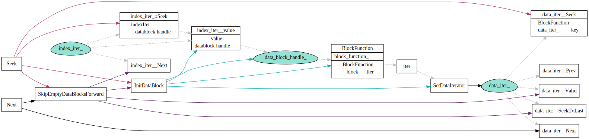

# Iterator 迭代器

## Iterator 继承关系

## BlockIter

Table中某个BlockData数据块的iter, 这里面有意思的restartPointer, restartPointer指向的record, key没有共享部分。
所以Seek时候先通过SeekToRestartPoint，找到合适的RestartPoint点，然后再使用ParseNextKey迭代遍历。

## LevelFileNumIterator

用于遍历一组FileMetadat中定位target所在的FileMeta Index, 在TwoLevelIterator中作为index iter使用。

## TwoLevelIterator

双层迭代器，先通过index找到对应的block，调用`block_function`创建相应的block iterator.
增加了SkipEmptyData检查，当一个blockIter迭代完后，自动切换到下一个block iter.

TwoLevelIterator可以套娃:
1. IndexBlockIter和DataBlockIter套在一起得到一个TableIterator
2. LevelFileNumIterator和TableIterator套在一次，得到某一层的Iterator.

## MergingIterator

归并N个有序的iterator.

## DBImpl::NewIterator

1. 内存中的mm_和imm_分别作为一路iter，放到merging iter中
2. level0层由于table文件之间有overlap的，所以每个level0对应tableIterator作为一路放在merging itertor中。
3. level1 ~ levenN层 LevelFileumIterator和TableIterator通过TwoLevelIterator套在一起，得到某一层的iterator.

