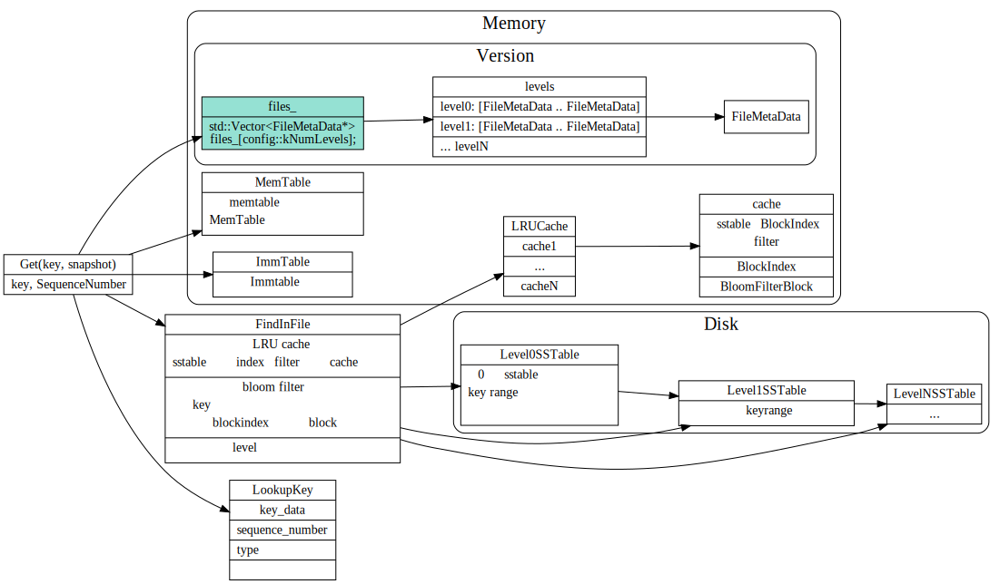

# LevelDB Read流程

### 数据读取流程

1. 根据key和options中snapshot 拼接为looupKey
2. 现在MemTable中查找，然后再immutable中查找，最后到level文件中查找。
3. 通过version中的`files_`可以获得当前version中所有level file的列表。
4. level0中的文件key range有重叠，所有要每个文件都搜索。
5. 其他level的通过fileMeta中记录的key range，定位到相应的sstable file.
6. 文件操作：先从cache中查找，是否sstable的datablock index和bloomfilter已在内存中，如果不在的话，加载这些到内存中。cache以LRU方式来更新，淘汰。
7. 先从datablock index中定位到相应的datablock和bloom filter,通过bloom filter快速查看key是否不存在，避免不必要的文件操作。
8. 文件操作: 读取datablock到内存中，做二分查找, 将datablock放到缓存中。

### 读取细节

涉及到的模块说明:

1. VersonSet负责维护version信息。
2. 每个version中的`file_`数据成员，维护了每个层级的FileMetaData.
3. 每个FileMetadata记录了该file的最大值和最小值，方便查找key,value时候，快速定位。
4. TableCache封装了Table和LRUCache逻辑。
5. Table封装了table加载，查找等逻辑。

