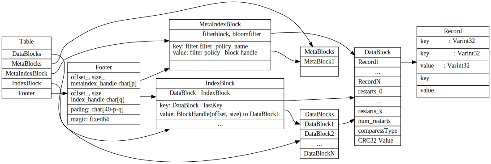
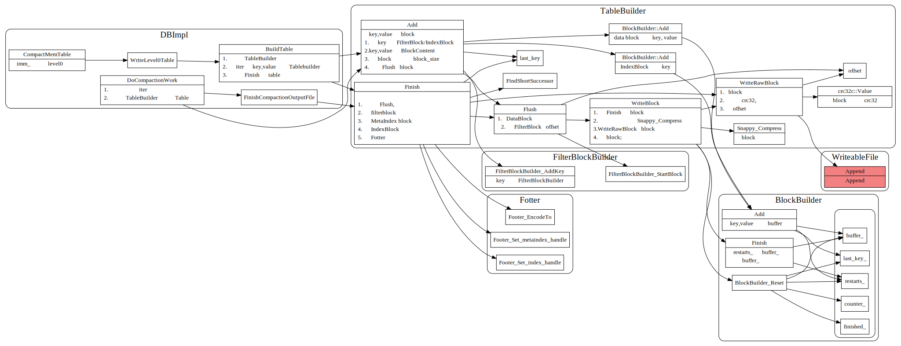

# SSTable 文件格式和读写

## Table format
table文件分为Foot,metadataindex, dataIndex, metadat block, datablock这几块。

1. Footer 48个字节，以Magic number为结尾。存储了指向metaDataIndex和DataIndex的BlockHandle（offset, size)
2. MetaBlock存储了bloomfilter 相关数据
3. DataIndexBlock 存储了每个block的lastKey，value为Datablock的blockHanle(offset和size)
4. MetaIndexBlock 中也是key,value形式，key为 `filter.filter_policy_name`，value为filterblockHandle, 当前只有bloomFilter
5. RestartPoint用于记录key shared共同前缀开始的位置。
6. 每个DataBlock/IndexBlock除了原始数据，还包含了compressType(是否压缩）以及CRC32用于校验。

## Table write 流程

## Table 读取流程

TableOpen中会读取文件的Footer, 读取indexBlock以及解析Metadatablock.

