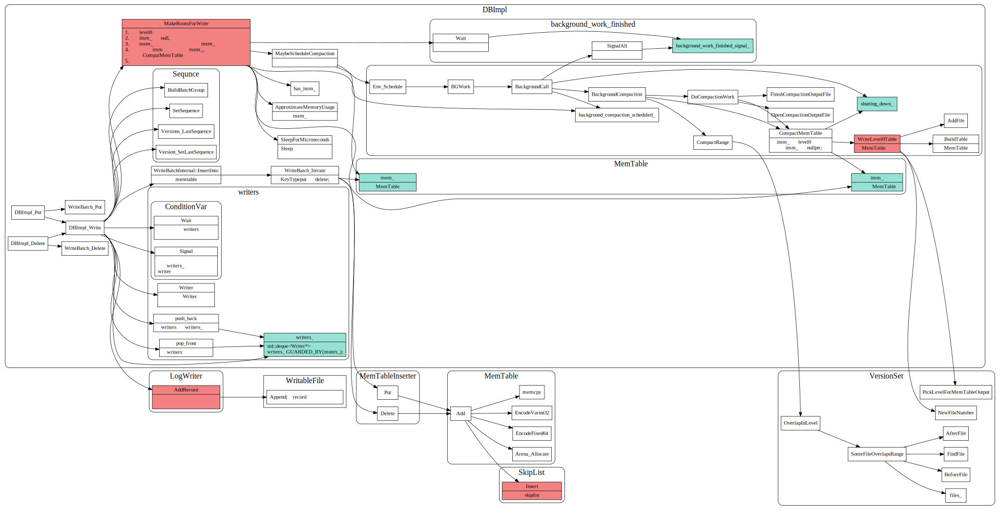
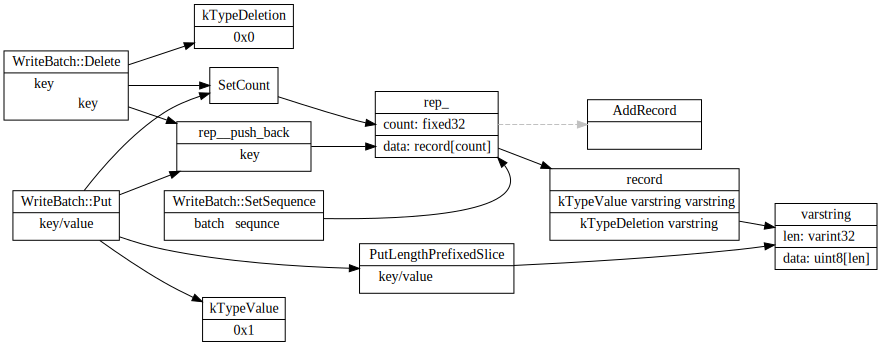

# LevelDB Write 流程

### 数据写入流程

leveldb中数据写入流程如下:

1. 首先会将kv batch写入日志中，如果宕机了，能从日志中恢复过来，由于采用顺序写的方式，速度很快。
2. 确保memtable的空间足够（没有超过一定大小限制），如果memtable没足够空间了，会新建一个memtable, 并将老的memtable转为
immtable，然后由后台压缩线程将immtable写入到level 0 文件。如果level 0 文件个数超过限制，也会触发background 压缩线程。
3. 将kv batch插入memtable中, memtable的底层实现为skiplist, 插入时间复杂度为O(Log(n)),每个key,value插入都有自己的sequnceNumber.
用来控制版本号.

### 写入细节

1. 由MakeRoomsForWrite来保证memtable空间足够写入新的kv，如果immtable正在等待被写到文件中，或者level0文件个数超过阈值了，则需要阻塞等待后台线程处理完毕。由``backgroup_work_finished_signal_``condvar控制。
2. 多线程写入时候，有个`writes_`队列做并发控制, writes_队列也使用condvar来控制，`writes_`队列开头的writer写完后，触发condvar，下个writer线程接着写。
3. immtable由`CompactMemtable`写入level 0文件
4. 后台线程压缩时候，先使用`PickCompaction`选择需要合并压缩的sstable文件，然后使用`DoCompactionWork`做归并排序合并。
5. 每次写入都会更新versionSet的LastSequnceNumber，用于版本控制,Sequnce越大，表明key,value值越新。

### WAL 日志写入

### WAL 日志恢复

