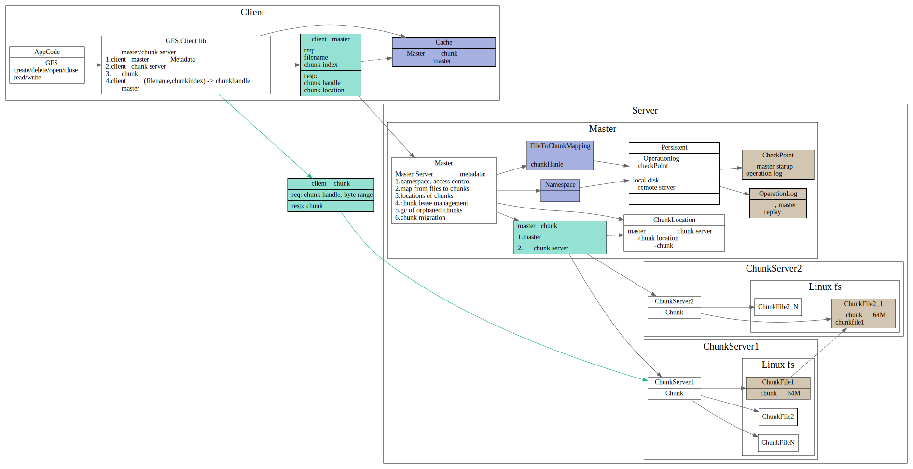

# GFS

## Questions

1. master 和chunk之间是怎么互相自动发现的？
2. master 和chunk之间心跳信息具体内容是啥
3. master信息存在哪儿？master挂了？集群都挂？
4. Cache怎么解决失效的问题？

### ChunkSize
chunksize 64MB的好处
1. 减轻client 和master的通信.
2. client和chunk server长时间通信,减少需要和多个chunk server网络通信

缺点：
1. 小文件只有一个或几个chunk，容易造成成为热点

### Metadata

master主要存储三种metadata
1. the file and chunk namespace
2. mapping from files to chunk
3. location of each chunk replica
这三个信息都存储在内存中，前两个信息会通过operation log, 持久化存储到磁盘上
信息3没有存在磁盘上，master询问每个chunk server, 来构建这个信息.

