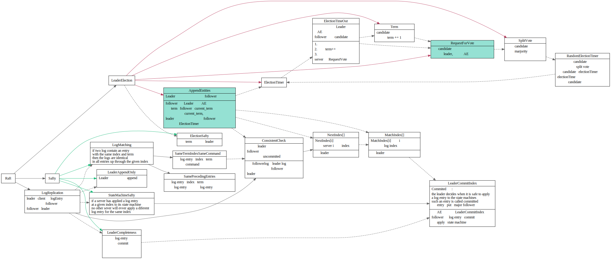

# Raft

major challenge:
* failure handling
* service discovery
* configure management

什么叫共识？
consensus group
高可用和可靠，consensus group中有几个member挂掉了也无所谓

## Raft server state

## AppendEntries请求

### Pre vote
raft中一个机器频繁掉线下
假设有三个server, s1, s2,s3, 其中s2为old leader, s1，s3是follower，s1和s2,s3之间网络频繁掉线。
1. election timeout , s1 进入candidate状态, s1将自己的term ++
2. s1和s2,s3之间通信恢复了，s1收到s2(leader)的AE请求，S1拒绝了S2 AE请求, s2成为follower
3. 

