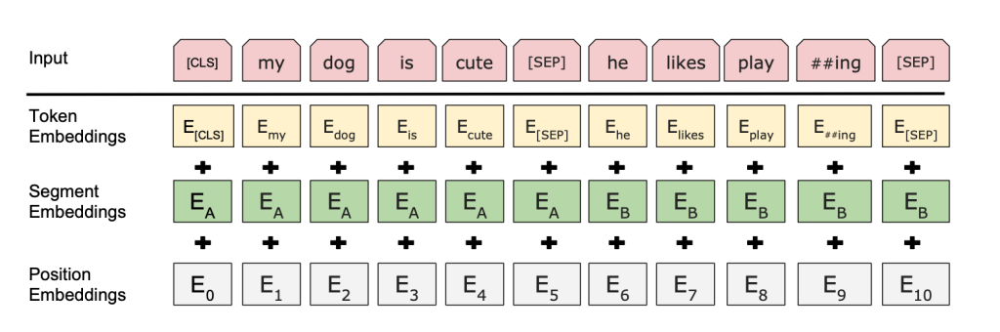

# Bert

## How to code bert 笔记

https://neptune.ai/blog/how-to-code-bert-using-pytorch-tutorial

## The Annotated transformer 笔记

Self-attention, sometimes called intra-attention is an attention mechanism relating different positions of a single sequence in order to compute a representation of the sequence

symbol representation -> encode -> continuous representations -> decode -> symbol representation

### Attention

An attention function can be described as mapping a query and a set of key-value pairs to an output, where the query, keys, values, and output are all vectors. The output is computed as a weighted sum of the values, where the weight assigned to each value is computed by a compatibility function of the query with the corresponding key

he two most commonly used attention functions are additive attention (cite), and dot-product (multiplicative) attention

## HuggingFace transformers

## huggingface/transformers

[transformers](https://github.com/huggingface/transformers/blob/master/README_zh-hans.md)

Questions: 怎么杨使用已经下载的model?

## 相关资料:
1. [how to code bert using pytorch tutorial](https://neptune.ai/blog/how-to-code-bert-using-pytorch-tutorial)
2. [illustrated transformer](https://jalammar.github.io/illustrated-transformer/)
3. [The Annotated Transformer](http://nlp.seas.harvard.edu/2018/04/03/attention.html)
