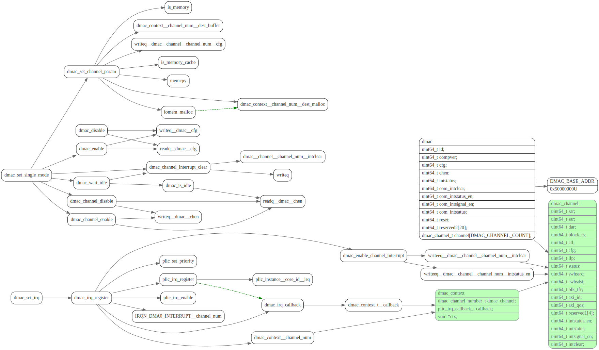

# comile流程

<!-- toc -->

## Compile过程

k210的kernels, 为啥看到的都是c++代码？不是应该直接调driver的方法吗？

## kpu

riscv-plic-spec:https://github.com/riscv/riscv-plic-spec/blob/master/riscv-plic.adoc

RISC-V Platform-Level Interrupt Controller Specification

## facedetect example

## kpu

### kpu_load_kmodel

### kpu_run_kmodel

 关键函数为`ai_step`，是pli中断的callback, 会一层层的执行kmodel
 看了kpu.c中的代码，貌似只有conv2d是在kpu上跑的，其他算子的都是c++代码
 应该是在cpu上跑的。

## dmac

## plic

[RISC-V Platform-Level Interrupt Controller Specification](https://github.com/riscv/riscv-plic-spec/blob/master/riscv-plic.adoc#introduction)

全局中断，也就是所说的外部中断，其他外设统统都是外部中断。外部中断连接在Platform-Level Interrupt Controller (PLIC)上。

PLIC需要一个仲裁决定谁先中断，存在个优先级的问题。

