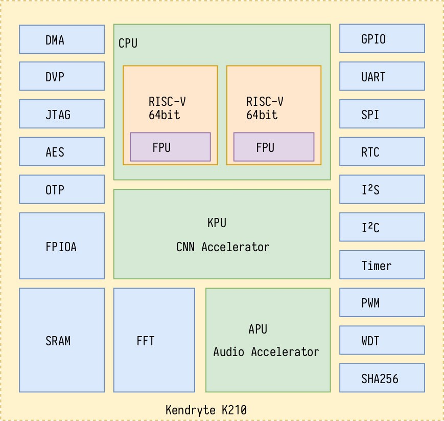
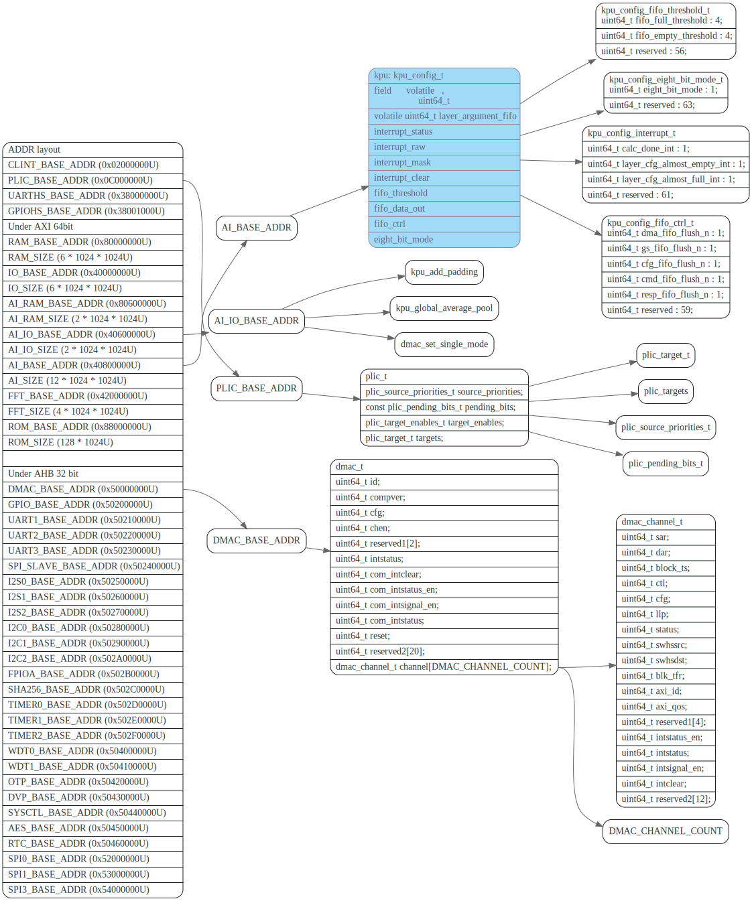
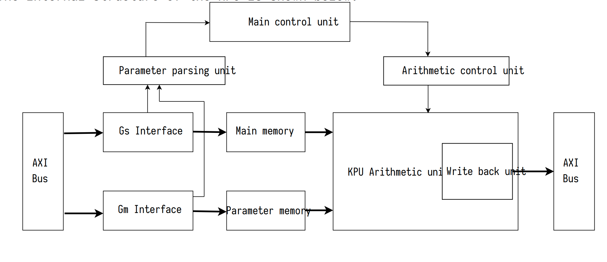
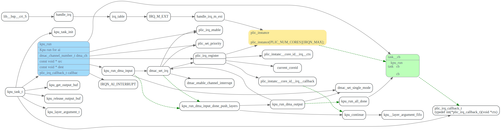
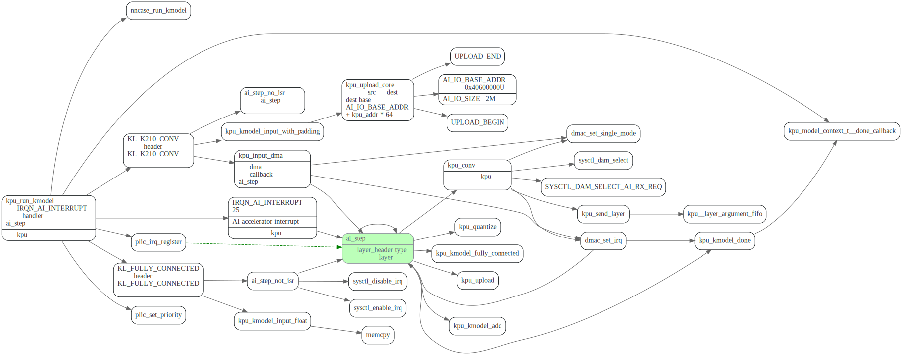
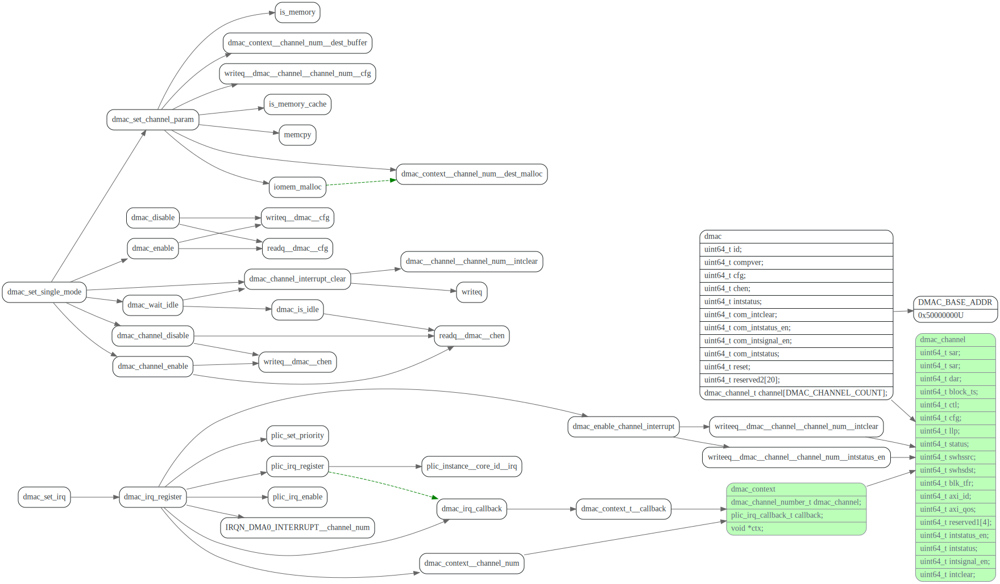
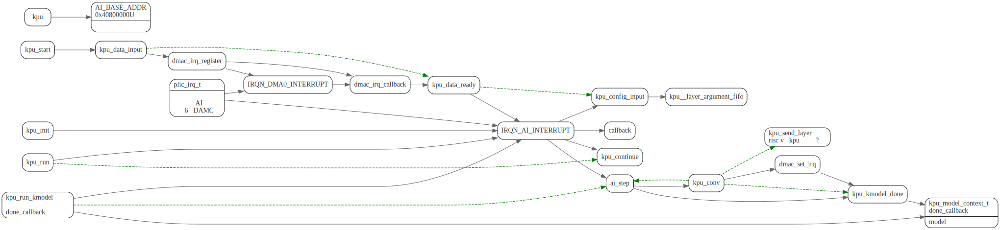

# k210 Standalone SDK

<!-- toc -->

## 相关资料文档

* Github地址：[https://github.com/kendryte/kendryte-standalone-sdk](https://github.com/kendryte/kendryte-standalone-sdk)
* K210 sdk开发文档: [英文pdf](https://s3.cn-north-1.amazonaws.com.cn/dl.kendryte.com/documents/kendryte_datasheet_20181011163248_en.pdf), [中文pdf](https://s3.cn-north-1.amazonaws.com.cn/dl.kendryte.com/documents/kendryte_standalone_programming_guide_20190704110318_zh-Hans.pdf)

## platform

根据platform.h中的地址定义，地址空间布局如下:

## kpu

AXI BUS是啥

> 你可以理解为一种用于传输数据的模块或者总线。用于两个模块或者多个模块之间相互递数据。反正它有一堆优点。。被SOC广泛采用了。

riscv-plic-spec:https://github.com/riscv/riscv-plic-spec/blob/master/riscv-plic.adoc

RISC-V Platform-Level Interrupt Controller Specification

### kpu_load_kmodel

### kpu_run_kmodel

 关键函数为`ai_step`，是pli中断的callback, 会一层层的执行kmodel
 看了kpu.c中的代码，貌似只有conv2d是在kpu上跑的，其他算子的都是c++代码
 应该是在cpu上跑的。

## dmac

## plic

[RISC-V Platform-Level Interrupt Controller Specification](https://github.com/riscv/riscv-plic-spec/blob/master/riscv-plic.adoc#introduction)

全局中断，也就是所说的外部中断，其他外设统统都是外部中断。外部中断连接在Platform-Level Interrupt Controller (PLIC)上。

PLIC需要一个仲裁决定谁先中断，存在个优先级的问题。

## 参考文献

1. [k210 SDK 文档](https://s3.cn-north-1.amazonaws.com.cn/dl.kendryte.com/documents/kendryte_standalone_programming_guide_20190704110318_zh-Hans.pdf)
