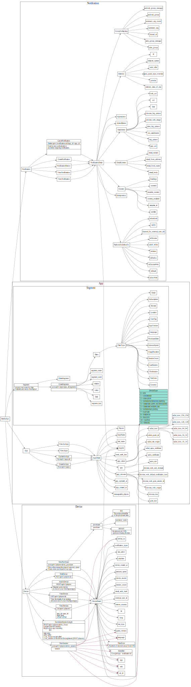
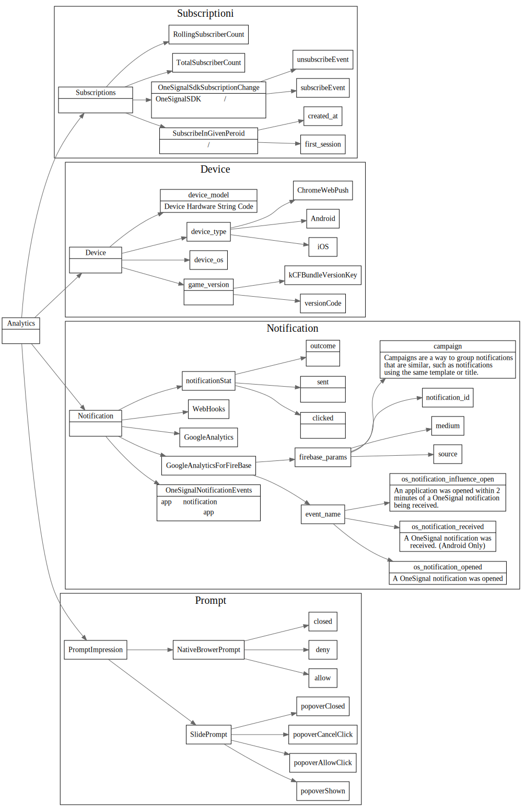

# OneSignal Restful API

## 整体api

## 数据流程

Notification数据下发

事件数据上行

## 数据上行
1. 收集了device那些数据？
2. 通过什么方法收集的?
3. 怎么处理海量设备的数据问题？
4. 收集后的数据需要怎么分析？需要分析那几方面？
5. 发送给firebase的数据，怎么拿回来？发给fireboase哪些数据?

## 数据分析

## 用户分组: Segments

