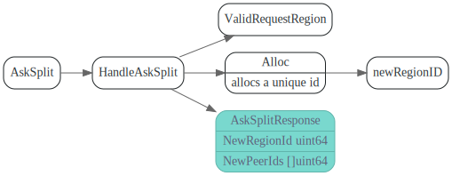

# PD

<!-- toc -->

> PD 是 TiKV 的全局中央控制器，存储整个 TiKV 集群的元数据信息，负责整个 TiKV 集群的调度，全局 ID 的生成，以及全局 TSO 授时等。

> PD 是一个非常重要的中心节点，它通过集成 etcd，自动的支持了分布式扩展以及 failover，解决了单点故障问题。关于 PD 的详细介绍，后续我们会新开一篇文章说明。

资料收集： 
1. 官方PD相关文档 https://pingcap.com/blog-cn/#PD


## 主要数据结构


### RaftCluster

```go
// RaftCluster is used for cluster config management.
// Raft cluster key format:
// cluster 1 -> /1/raft, value is metapb.Cluster
// cluster 2 -> /2/raft
// For cluster 1
// store 1 -> /1/raft/s/1, value is metapb.Store
// region 1 -> /1/raft/r/1, value is metapb.Region
```


### BasicCluster

provides basic data member and interface of a tikv cluster

用来在内存中保存(查找) tikv cluster的store和region信息


## Main 流程


## GRPC Service api

### Bootstrap


### StoreHeartbeat

定期 store 向 PD 汇报自己的相关信息，供 PD 做后续调度。譬如，Store 会告诉 PD 当前的磁盘大小，以及剩余空间，如果 PD 发现空间不够了，就不会考虑将其他的 Peer 迁移到这个 Store 上面。


###  RegionHeartbeat

Region Leader定期向pd 汇报region情况，PD返回Operator


### AskSplit



### SplitRegions

### GetRegion


