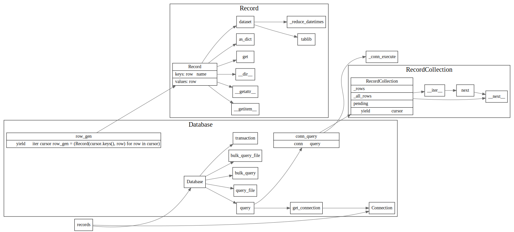

# records

[github records]https://github.com/kennethreitz-archive/records

```python
import records

db = records.Database('postgres://...')
rows = db.query('select * from active_users')    # or db.query_file('sqls/active-users.sql')
```


