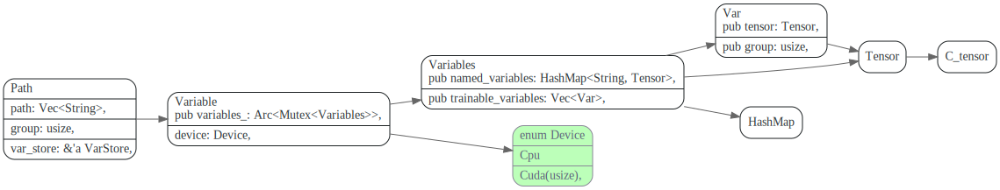
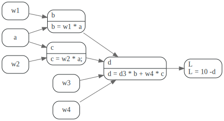

# PyTorch


## tch-rs


tensor 相关结构之间关系



## autograd




梯度反向传播

requires_grad 这个具有传染性, 
grad_fn

```python
>> t1 = torch.randn((3,3), requires_grad=True);
>> t2 = 3 * t2;
>> t2.requires_grad
True
>>> t2.grad_fn
<MulBackward0 object at 0x100df4f70>
```

torch.nn.Autograd.Function class

toch/autograd/function.py:222
```py
# mypy doesn't understand `with_metaclass` from torch._six
class Function(with_metaclass(FunctionMeta, _C._FunctionBase, FunctionCtx, _HookMixin)):  # type: ignore[misc]
    r"""Base class to create custom `autograd.Function`

    To create a custom `autograd.Function`, subclass this class and implement
    the :meth:`forward` and :meth:`backward` static methods. Then, to use your custom
    op in the forward pass, call the class method ``apply``. Do not call
    :meth:`forward` directly.

    To ensure correctness and best performance, make sure you are calling the
    correct methods on ``ctx`` and validating your backward function using
    :func:`torch.autograd.gradcheck`.

    See :ref:`extending-autograd` for more details on how to use this class.
```
最主要的两个方法，forward 和backward

> gradient that is backpropagated to f from the layers in front of it multiplied by the local 
> gradient of the output of f with respect to it's inputs.

向自己的每个input 反向传播。
```python
def backward (incoming_gradients):
	self.Tensor.grad = incoming_gradients

	for inp in self.inputs:
		if inp.grad_fn is not None:
			new_incoming_gradients = //
			  incoming_gradient * local_grad(self.Tensor, inp)
			
			inp.grad_fn.backward(new_incoming_gradients)
		else:
			pass
```

## 学习资料

1. [PyTorch 101, Part 1: Understanding Graphs, Automatic Differentiation and Autograd](https://blog.paperspace.com/pytorch-101-understanding-graphs-and-automatic-differentiation/)
2. [Implementing word2vec in PyTorch (skip-gram model)](https://towardsdatascience.com/implementing-word2vec-in-pytorch-skip-gram-model-e6bae040d2fb)
3. [The Ultimate Guide To PyTorch](https://blog.paperspace.com/ultimate-guide-to-pytorch/)
