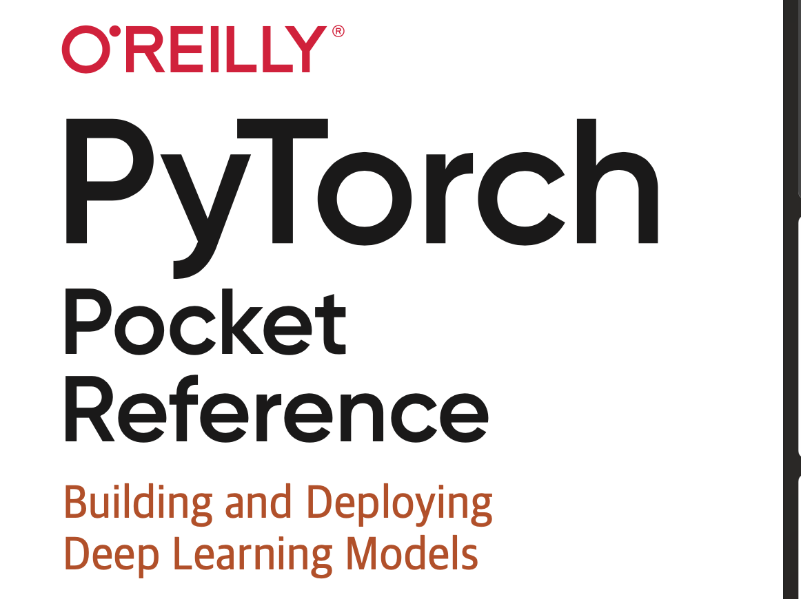
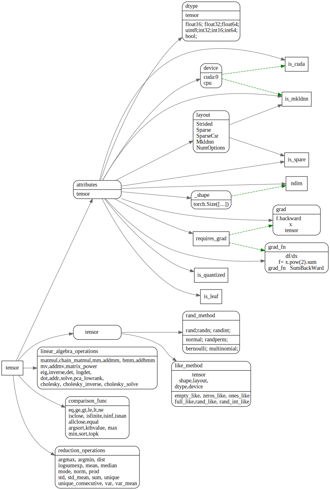
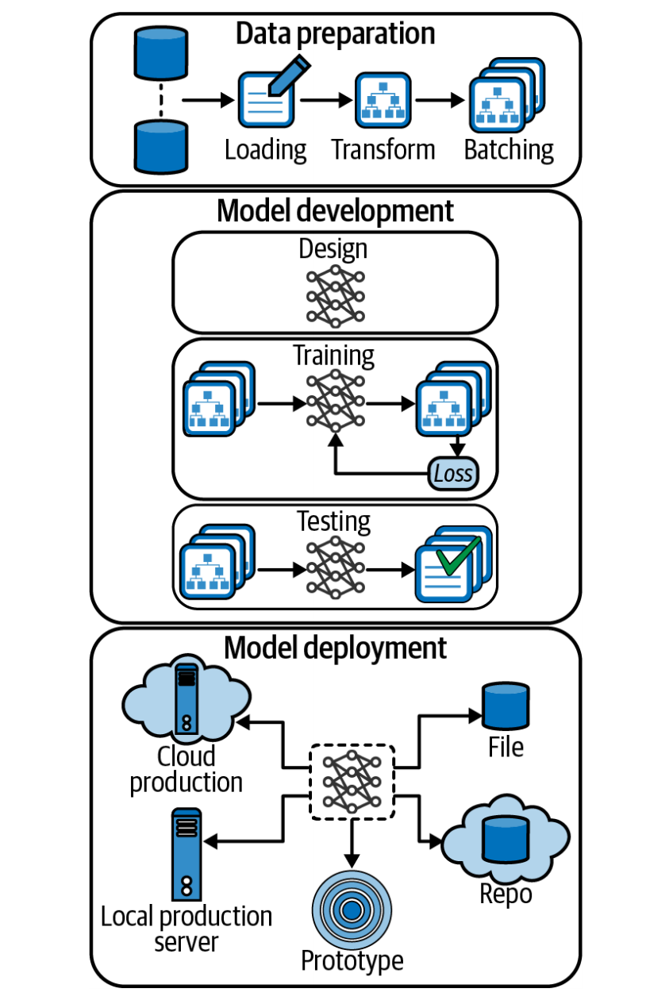
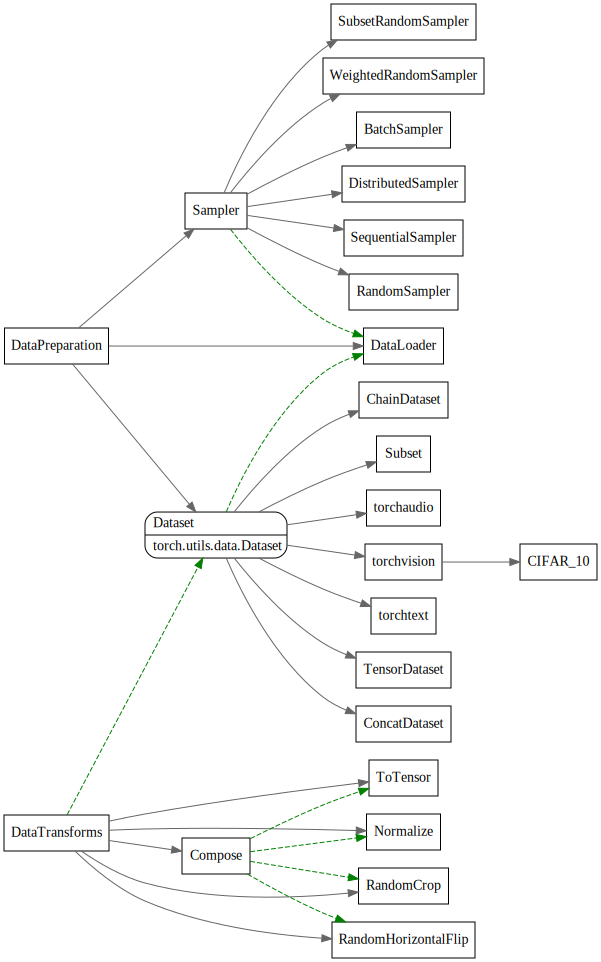
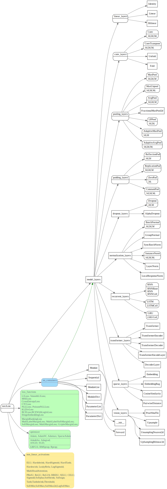

# 《Pytorch Pocket Reference》 笔记



<!-- toc -->


## Tensor

tensor相关属性和方法

```python
import torch

x = torch.tensor([[1.0,2], [3,4]], requires_grad=True)
print(x)
print(x[1,1])
print(x[1,1].item())
print("shape of x is", x.shape)
print("ndim of x is", x.ndim)
print("device of x is ", x.device)
print("layout of x is", x.layout)

f = x.pow(2).sum()
print(f)
print("before backward, grad of x is", x.grad)
f.backward()
print("after backwrad, grad of x is", x.grad)
print("grad_fn of x is", x.grad_fn)
print("grad_fn of f is", f.grad_fn)
```




## deep learning dev with Pytorch

深度学习开发流程，先数据预处理，然后做模型训练，最后做模型推理部署。



### 数据预处理



### 模型开发

torch.nn 预制了很多函数和神经网络层
1. 神经网络layer(有全连接层，卷积，池化，normalized, dropout, 各种非线性激活函数）
2. 损失函数
3. 优化器
4. layer的container.



### 模型训练

```python
from torch import optim
from torch import nn


# 定义模型
model = LeNet5().to(device)

# 定义损失函数
criterion = nn.CrossEntropyLoss()

# 定义优化器
optimizer = optim.SGD(model.parameters(), lr=0.001, momentum=0.9)

# 模型训练和验证
N_EPOCHS = 10
for epoch in range(N_EPOCHS):
  # Training
  train_loss = 0.0
  model.train()
  for inputs, labels in trainloader:
    inputs = inputs.to(device)
    labels = labels.to(device)
    optimizer.zero_grad()
    outputs = model(inputs)
    loss = criterion(outputs, labels)
    loss.backward()
    optimizer.step()
    train_loss += loss.item()

  # Validation
  val_loss = 0.0
  model.eval()
  for inputs, labels in valloader:
    inputs = inputs.to(device)
    labels = labels.to(device)

```


### 模型部署

训练好的模型保存到指定的文件，然后在后面使用时，使用`load_state_dict`重新加载模型

```python
model.train()
# train model
# save model to file
torch.save(model.state_dict(), "./lenet5_model.pt")

# load model
model = LeNet5().to(device)
model.load_state_dict(torch.load("./lenet5_model.pt"))
# use model predict
model.eval()
```
