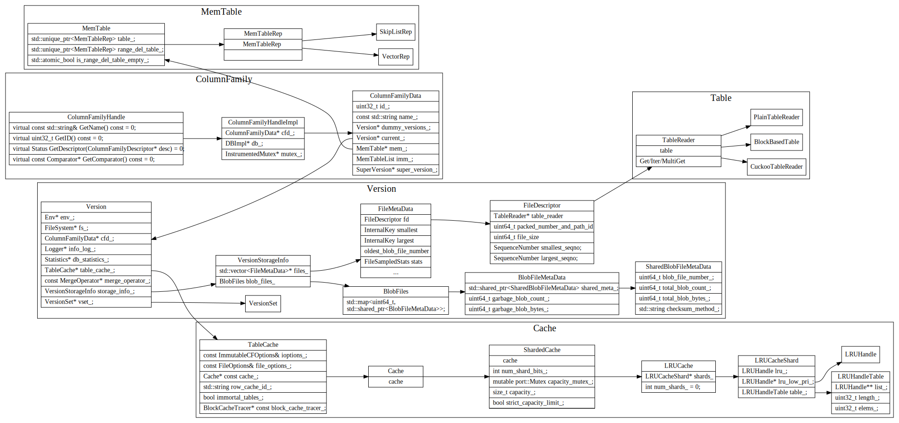

# Column Family

1. 每个columnFamily有单独的Version, memtable以及imm memtable list
2. VersionStorageInfo 存储了属于该version的所有Filemetadata信息
3. 读取时候，先从columnFaimly的memTable，然后imm list，然后version 中的各个level的文件
4. 写时候，先写WAl日志，然后插入到memtable中，memtable在满时候，会转到imm list中, 然后由
后台线程flush到level0, 后台线程compact.

rocks db中主要数据结构关系如下：

数据结构之间引用细节如下：

