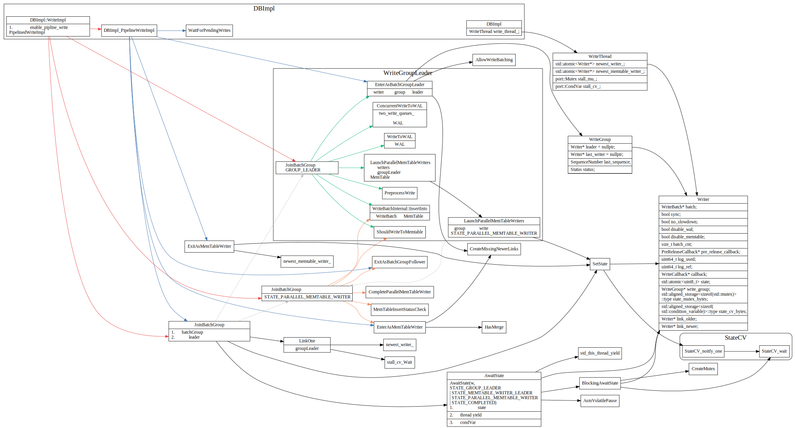
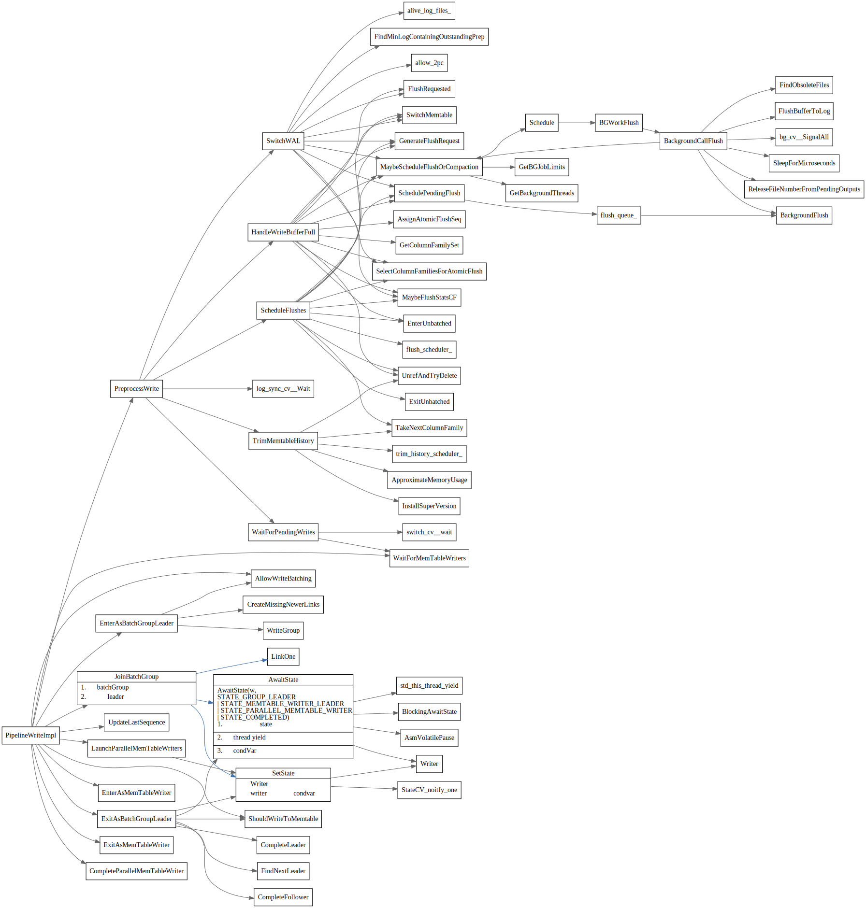
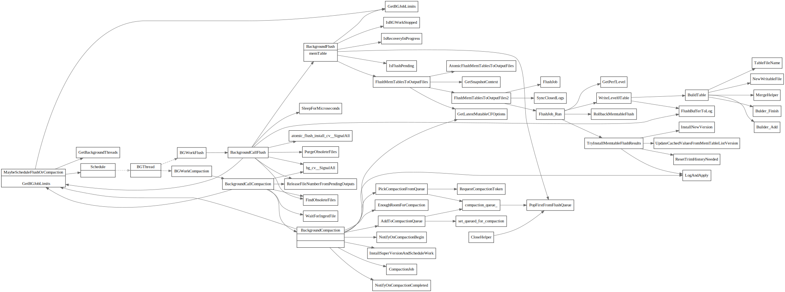
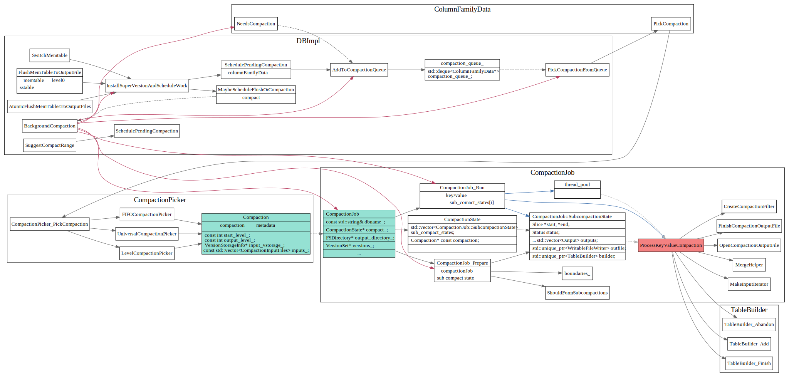

# Draft

## Class之间关系

## Write

1. 最终怎么写到了memTable中。
2. WAL写的流程是什么样？

## WriteBatch

## ColumnFamily

1. Blob 中value和key是怎么对的上的？
2. 数据结构之间怎么串起来的。 

## Write Thread

Writer的状态

write thread过程
Write group leader 负责写入WAL日志。
memtable可能由group leader写，也有可能由各个writer 并发写。

write thread是对写线程的抽象

write impl

## PreprocessWrite

## 后台压缩

MaybeScheduleFlushOrCompaction

后台线程压缩

compaction job之间是怎么划分的？怎么让不同线程去compact不同部分？

## compaction picker

## level compaction picker

以下两张图摘自facebook wiki [leveled-compaction](https://github.com/facebook/rocksdb/wiki/Leveled-Compaction)

