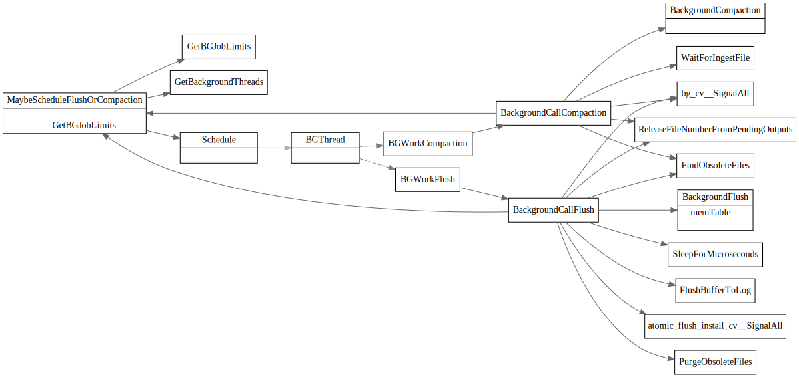
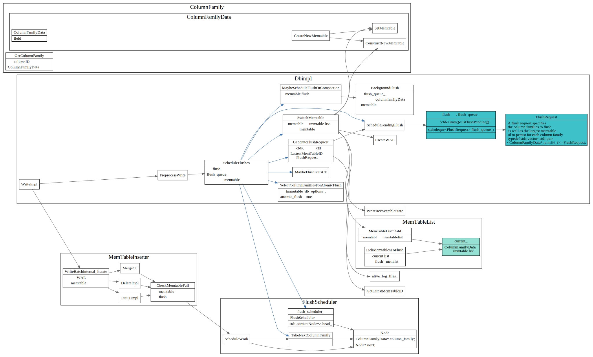
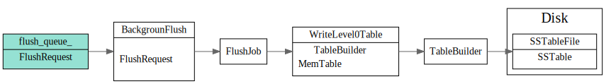
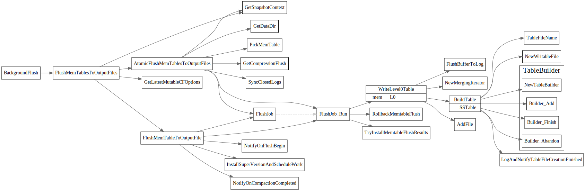

# 后台刷盘和压缩过程

### MaybeScheduleFlushOrCompaction

`MaybeScheduleFlushOrCompaction`会使用线程池调度，最后在后台线程中调用`BackgroundFlush`
和`BackgrondCompaction`分别做memtable的flush和ssfile的compaction.

### 后台线程调度Schedule

### 后台线程flush

后台线程会去`flush_queue_`队列中去获取要flush的memtable, 向`flush_queue_`中放入FlushRequest流程如下:

具体细节如下：

后台线程从`flush_queue_`中取出FlushRequest转换为FlushJob. 

最终调用`WriteLevel0Table` 将memtable写入磁盘中，具体调用关系如下:

### 后台线程compact

TODO: compaction job的数据来源需要梳理一下

#### Compaction Picker

三种compaction style

Level Style Compaction

Universal Style Compaction

FIFO Style Compaction
