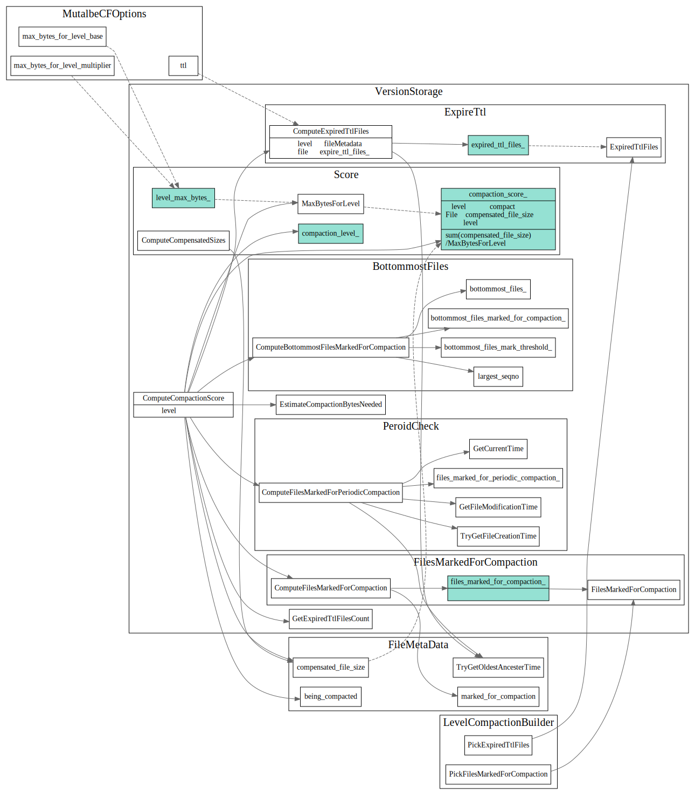

# Compaction Picker

## Compaction生成流程:

1. SetupInitialFiles 选择要compaction的level和input files
2. SetupOtherL0FilesIfNeeded和SetupOtherInputsIfNeeded补充选择和input files overlap的文件
3. 最后GetCompaction 生成最终的Compaction然后重新CompuateScore用于下次Compact

SetupInitialFiles 初始选择的优先级顺序，当前一个选择为空时候，才会去选择下一个:

### CompactionScore

#### TODO拆分为不同的子图

### 详细调用图如下

## Ref
1. leveled-compaction: https://github.com/facebook/rocksdb/wiki/Leveled-Compaction
2. choose level compaction files: https://github.com/facebook/rocksdb/wiki/Choose-Level-Compaction-Files
