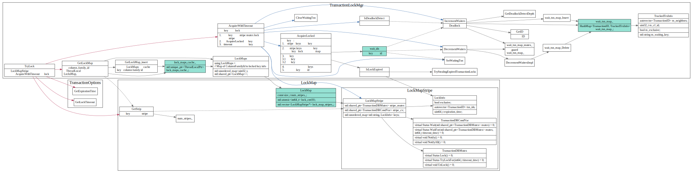

# Transaction lock mgr

### LockMap

rocksdb中对于key lock做了多种优化

1. 首先根据ColumnFamilyId, 从LockMaps获得对应的LockMap
2. 使用了thread local data来缓存全局的lock maps, 避免每次查询全局的lockmaps需要加锁
3. 使用`GetStripe`把key做sharding获得相应的LockStripe,降低了锁冲突, 但是在同一个stripe中的key还是有并发等待问题.


```cpp
size_t LockMap::GetStripe(const std::string& key) const {
  assert(num_stripes_ > 0);
  return fastrange64(GetSliceNPHash64(key), num_stripes_);
}
```

`GetLockMap`封装装了从thread local cache获取lockMap逻辑

```cpp
std::shared_ptr<LockMap> TransactionLockMgr::GetLockMap(
    uint32_t column_family_id) {

  // First check thread-local cache
  if (lock_maps_cache_->Get() == nullptr) {
    lock_maps_cache_->Reset(new LockMaps());
  }

  auto lock_maps_cache = static_cast<LockMaps*>(lock_maps_cache_->Get());

  //首先从thread local cache中查找
  auto lock_map_iter = lock_maps_cache->find(column_family_id);
  if (lock_map_iter != lock_maps_cache->end()) {
    // Found lock map for this column family.
    return lock_map_iter->second;
  }

  //没找到的话，使用mutex访问全局LockMaps
  // Not found in local cache, grab mutex and check shared LockMaps
  InstrumentedMutexLock l(&lock_map_mutex_);

  lock_map_iter = lock_maps_.find(column_family_id);
  if (lock_map_iter == lock_maps_.end()) {
    return std::shared_ptr<LockMap>(nullptr);
  } else {
    //插入到thread local cache中，方便下一次访问
    // Found lock map.  Store in thread-local cache and return.
    std::shared_ptr<LockMap>& lock_map = lock_map_iter->second;
    lock_maps_cache->insert({column_family_id, lock_map});

    return lock_map;
  }
}
```

### 获取/释放key锁


### 死锁检测


