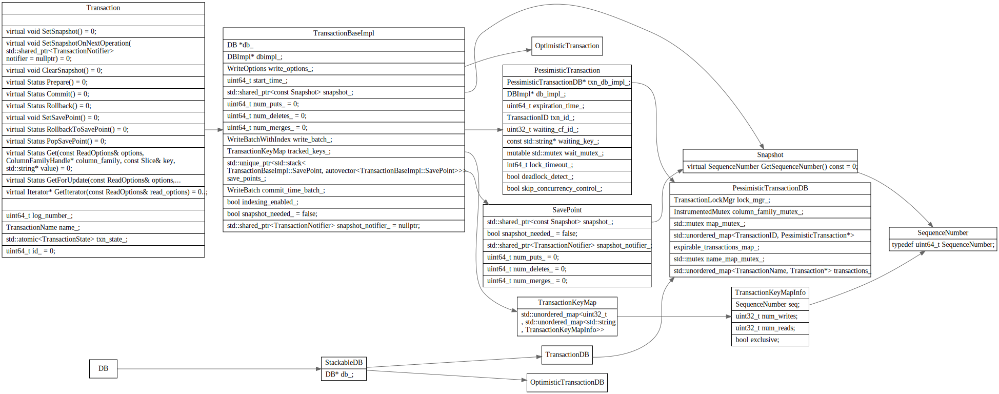
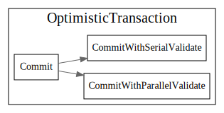
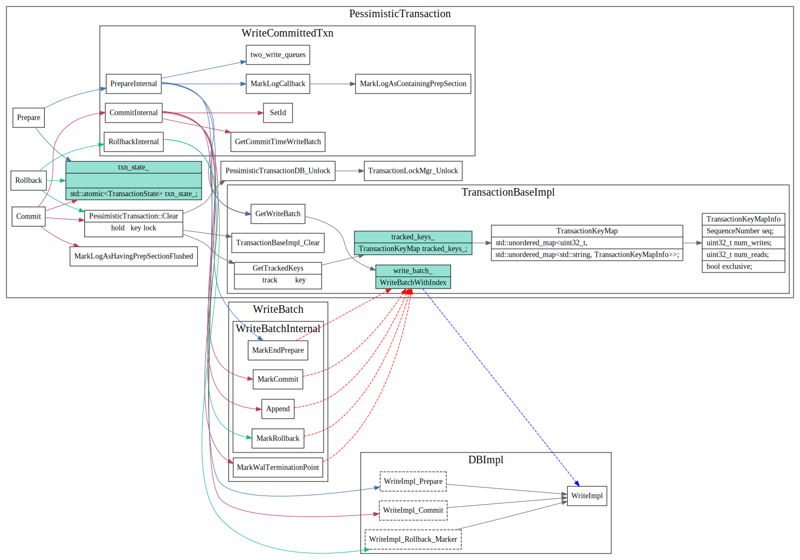

# Transaction

## Transaction struct

## 乐观事务
在commit的时候才去检查key的冲突

一些问题：

1. 根据什么判断是否有冲突的？貌似是根据sequnceNumber，但是具体细节不太清楚
2. `bucketed_locks_`的作用是啥？
3. CommitWithSerialValidate和 CommitWithParallelValidate这两者区别是啥？

## 悲观事务

分为三种？
1. writeCommitedTxn

WriteCommitted, which means that the data is written to the DB, i.e., the memtable, only after the transaction is committed

2. WritePrepared
3. WriteUnpreparedTxnDB

### Write Committed

The default write policy in pessimistic transactions is WriteCommitted, which means that the data is written to the DB, i.e., the memtable, only after the transaction is committed.

### WritePrepared

## 参考

[Facebook WritePrepared](https://github.com/facebook/rocksdb/wiki/WritePrepared-Transactions)
