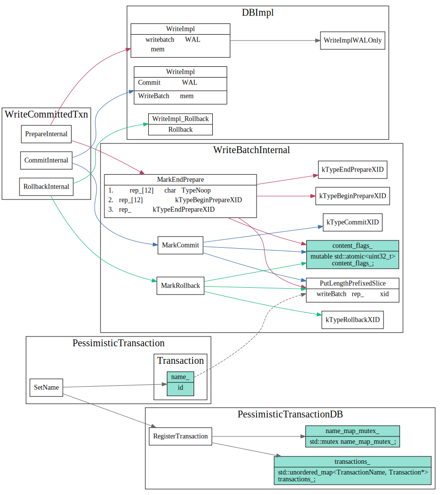

# 两阶段提交



```cpp
Status WriteBatchInternal::MarkEndPrepare(WriteBatch* b, const Slice& xid,
                                          bool write_after_commit,
                                          bool unprepared_batch) {
  // other code..
  // rewrite noop as begin marker
  b->rep_[12] = static_cast<char>(
      write_after_commit ? kTypeBeginPrepareXID
                         : (unprepared_batch ? kTypeBeginUnprepareXID
                                             : kTypeBeginPersistedPrepareXID));
  b->rep_.push_back(static_cast<char>(kTypeEndPrepareXID));
  PutLengthPrefixedSlice(&b->rep_, xid);
  // other code..
}
