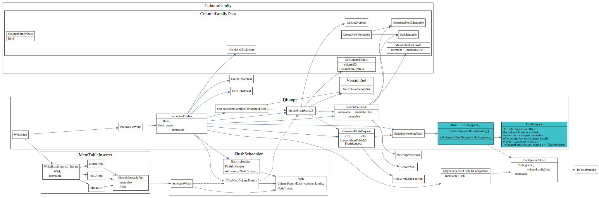

# RocksDB Write流程

## WriteBatch

## PreprocessWrite

### schedule flush

schedule flush, 将满的memtable转变为immtable, 加到`flush_schedule_`队列中
由`BackgrounFlush`将immtable刷到dish上。

## Write thread

Writer的状态

write 相关struct之间引用关系

