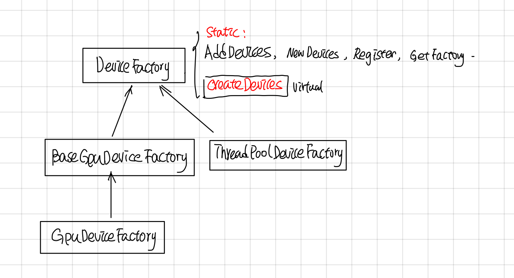

Tensorflow Device
-----------------

### 摘要

Device包含了自己的memory的计算单元，它是对GPU， TPU， CPU等计算device统一抽象，主要的接口有以下几个：

1. GetAllocator: 这个返回一个allocator，负责在device上分配memory
2. Compute，ComputeAsync: 负责执行OpKernel中的运算。
3. ResourceMgr: 负责管理分配在Device上的Variable
4. tensorflow device thread pool: 调度执行device compute的线程池。

其中1，2最重要，分别负责allocate memory和执行opkernel的compute。


### Device

#### Device的继承关系


#### Device thread pool

Gpu对应的线程池创建有三种模式:global, gpu_private, gpu_shared，由环境变量TF_GPU_THREAD_MODE控制, 默认是global的。

1. global: GPU uses threads shared with CPU in the main compute, thread-pool. This is currently the default.
2. gpu_private: GPU uses threads dedicated to this device.
3. gpu_shared: All GPUs share a dedicated thread pool.

在DirectSession::Ruinternal调用executor的时候，会把device_thread_pool 传给Executor

```cpp
//  DirectSession::RunInternal

    thread::ThreadPool* device_thread_pool =
        item.device->tensorflow_device_thread_pool();
    if (!device_thread_pool) {
      args.runner = default_runner;
    } else {
      args.runner = [this, device_thread_pool](Executor::Args::Closure c) {
        SchedClosure(device_thread_pool, std::move(c));
      };
    }
    item.executor->RunAsync(args, barrier->Get());
  }
```

在分布式tensorflow中，GraphMgr::StartParallelExecutors, 通过类似的方法吧device_thread_pool 传给executor。
```cpp
//GraphMgr::StartParallelExecutors
    thread::ThreadPool* device_thread_pool =
        item.device->tensorflow_device_thread_pool();
    if (!device_thread_pool) {
      args.runner = default_runner;
    } else {
      args.runner = [this, device_thread_pool](Executor::Args::Closure c) {
        SchedClosure(device_thread_pool, std::move(c));
      };
    }
    item.executor->RunAsync(args, barrier->Get());
  }
```

在Executor::schedulReady中，会使用这个runner去执行node的process。
```cpp
// Executor::ScheduleReady
//Case 1

//other code and 
// Schedule to run all the ready ops in thread pool.
runner_([=]() { Process(tagged_node, scheduled_usec); });

//other code and if...
// Dispatch to another thread since there is plenty of work to
// do for this thread.
runner_(std::bind(&ExecutorState::Process, this, *curr_expensive_node, scheduled_usec));

//other code under some if ...
 // There are inline nodes to run already. We dispatch this expensive
 // node to other thread.
runner_(std::bind(&ExecutorState::Process, this, *curr_expensive_node, scheduled_usec));
```


### Device Context

GpuDeviceContext有点复杂，有不少的代码逻辑是用来处理一个GPU 启动了多个streams的，graph中的每个node会分配一个stream_id。

#### device context map
每个node对应OpKernel的device_context会使用这个stream_i来CopyCpuTensorToDevice， CopyDeviceTensorToCpu, 在Compute的时候，opkernel的计算也会这个stream_id对应的stream上执行。


不过现在好玩的是现在BaseGPuDevice的构造函数中max_stream传的值为1，使用多个stream的特性没开，大家用的是同一个stream，在stackflow上搜到了一个为啥这么做的回答：

> Yeah, you are looking at code that is a bit stale; we've tried experimenting with multiple compute streams and have found that, so far, it hasn't helped that much in important use cases. We technically support multiple streams, but we never turn it on.
> 
> At some point in the future, we want to start playing around with using multiple compute streams again though, so it's nice to have the code there.
> 
> Devices can use as many DeviceContexts as they want; on GPU we only use a few and we use FillContextMap to do the mapping, but it really depends on the hardware how they should be used
> 

目前这个特性是实验性的，在重要的use cases中没起到重要的作用，所以这个特性没开, 后续可能会开，所以这部分代码保留了。

除此之外，还在stream_id的基础上做了一个EigenDevice，估计是给Eigen计算提供的吧。无论怎样，DeviceContext给每个Opkernel包了stream_id，然后在执行的时候，会找到这个stream_id对应的cuda_stream。


#### Eigen::GpuDevice

给Eigen::GpuDevice封装了一个EigenCudaStreamDevice, 用来给Eigen::GpuDevice allocate和deallocate memroy, 具体的怎么用的估计要去挖Eigen的代码了, 还有scratch buffer的作用也不是很明白。

```cpp
class EigenCudaStreamDevice : public ::Eigen::StreamInterface 
  // allocate
  void* allocate(size_t num_bytes) const override{
    //使用device的allocate进行内存分配
  }

  //deallocate
  void deallocate(void* buffer) const override {
   //异步的AsyncFreeData，最终调用的是Device的allocate去free内存
  }
```

#### Compute

Gpu的Compute部分主要有BaseGpuDevice::ComputeHelper来处理，主要是如果gpu使用了多个stream特性的话，需要等待input的stream都完成之后，再执行op对应的stream。

```cpp
void BaseGPUDevice::ComputeHelper(OpKernel* op_kernel,
  //如果是多个stream,需要等待所有input的stream执行完毕。
  if (num_streams > 1) {
    // If this op's device context is different from the other contexts,
    // we must wait on the stream.
    for (int i = 0; i < context->num_inputs(); ++i) {
      const GPUDeviceContext* idc =
          static_cast<GPUDeviceContext*>(context->input_device_context(i));
      //other code: 主要是log
      if (idc->stream() != stream) stream->ThenWaitFor(idc->stream());
    }
  gpu::cuda::ScopedActivateExecutorContext scoped_activation{stream->parent()};
  op_kernel->Compute(context);
  //other code: 主要是cuda执行状态检查
```


### Device Factory

DeviceFactory的继承关系如下：



DeviceFactory包含了一些静态函数： AddDevices, NewDevices, Register, GetFactory, 和一个virutal CreateDevices。
NewDevices用于自动化测试，对外主要接口是AddDevices, Register负责device factory的注册, 这两者的调用关系如下：


DeviceFactory也采用了static registor的方法，自动注册了DeviceFactory,
```cpp
//device_type, DeviceFactoryClass, Prority
REGISTER_LOCAL_DEVICE_FACTORY("CPU", ThreadPoolDeviceFactory, 60);
REGISTER_LOCAL_DEVICE_FACTORY("CPU", GPUCompatibleCPUDeviceFactory, 70);
REGISTER_LOCAL_DEVICE_FACTORY("GPU", GPUDeviceFactory, 210);
```

这个宏展开后是声明了一个Registrar的 static var, 在它的构造函数中会去调用DeviceFactory的Register注册Factory，
而Register函数最后会把Factory 加入到static device_factories中。

```cpp
template <class Factory>
class Registrar {
 public:
  explicit Registrar(const string& device_type, int priority = 50) {
    DeviceFactory::Register(device_type, new Factory(), priority);
  }
}
```

在创建一个DirectSesion, 或者GrpServer::Init(每个worker都会起一个GrpcServer)的时候，会调用AddDevices获取worker上的devices.
