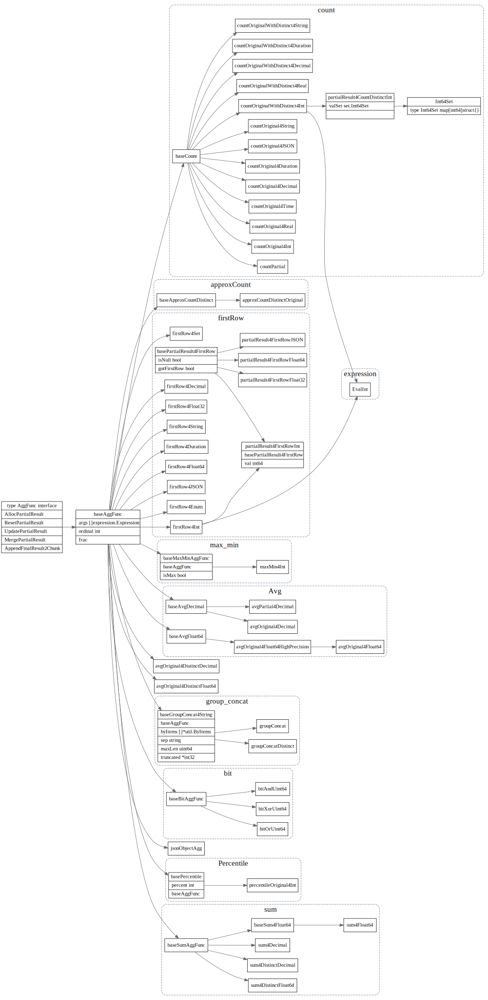
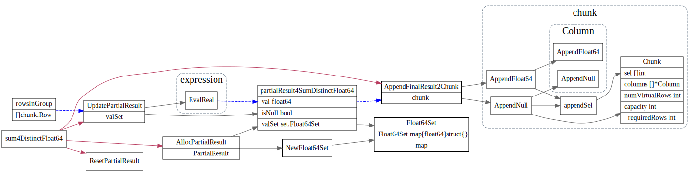

# AggFunc

<!-- toc -->

## AggFuncDesc

```go
type AggFuncDesc struct {
	baseFuncDesc
	// Mode represents the execution mode of the aggregation function.
	Mode AggFunctionMode
	// HasDistinct represents whether the aggregation function contains distinct attribute.
	HasDistinct bool
	// OrderByItems represents the order by clause used in GROUP_CONCAT
	OrderByItems []*util.ByItems
}
```

### AggFunctionMode
```go
// AggFunctionMode stands for the aggregation function's mode.
type AggFunctionMode int

// |-----------------|--------------|--------------|
// | AggFunctionMode | input        | output       |
// |-----------------|--------------|--------------|
// | CompleteMode    | origin data  | final result |
// | FinalMode       | partial data | final result |
// | Partial1Mode    | origin data  | partial data |
// | Partial2Mode    | partial data | partial data |
// | DedupMode       | origin data  | origin data  |
// |-----------------|--------------|--------------|
const (
	CompleteMode AggFunctionMode = iota
	FinalMode
	Partial1Mode
	Partial2Mode
	DedupMode
)
```


## AggFunc interface

```go
// AggFunc is the interface to evaluate the aggregate functions.
type AggFunc interface {
	// AllocPartialResult allocates a specific data structure to store the
	// partial result, initializes it, and converts it to PartialResult to
	// return back. The second returned value is the memDelta used to trace
	// memory usage. Aggregate operator implementation, no matter it's a hash
	// or stream, should hold this allocated PartialResult for the further
	// operations like: "ResetPartialResult", "UpdatePartialResult".
	AllocPartialResult() (pr PartialResult, memDelta int64)

	// ResetPartialResult resets the partial result to the original state for a
	// specific aggregate function. It converts the input PartialResult to the
	// specific data structure which stores the partial result and then reset
	// every field to the proper original state.
	ResetPartialResult(pr PartialResult)

	// UpdatePartialResult updates the specific partial result for an aggregate
	// function using the input rows which all belonging to the same data group.
	// It converts the PartialResult to the specific data structure which stores
	// the partial result and then iterates on the input rows and update that
	// partial result according to the functionality and the state of the
	// aggregate function. The returned value is the memDelta used to trace memory
	// usage.
	UpdatePartialResult(sctx sessionctx.Context, rowsInGroup []chunk.Row, pr PartialResult) (memDelta int64, err error)

	// MergePartialResult will be called in the final phase when parallelly
	// executing. It converts the PartialResult `src`, `dst` to the same specific
	// data structure which stores the partial results, and then evaluate the
	// final result using the partial results as input values. The returned value
	// is the memDelta used to trace memory usage.
	MergePartialResult(sctx sessionctx.Context, src, dst PartialResult) (memDelta int64, err error)

	// AppendFinalResult2Chunk finalizes the partial result and append the
	// final result to the input chunk. Like other operations, it converts the
	// input PartialResult to the specific data structure which stores the
	// partial result and then calculates the final result and append that
	// final result to the chunk provided.
	AppendFinalResult2Chunk(sctx sessionctx.Context, pr PartialResult, chk *chunk.Chunk) error
}
```
## AggFunc 数据继承关系

```go
type baseAggFunc struct {
	// args stores the input arguments for an aggregate function, we should
	// call arg.EvalXXX to get the actual input data for this function.
	args []expression.Expression

	// ordinal stores the ordinal of the columns in the output chunk, which is
	// used to append the final result of this function.
	ordinal int

	// frac stores digits of the fractional part of decimals,
	// which makes the decimal be the result of type inferring.
	frac int
}
```



### sum4Float64


### sum4DistinctFloat64

>存在某个聚合函数参数为 DISTINCT 时。TiDB 暂未实现对 DedupMode 的支持，因此对于含有 DISTINCT 的情况目前仅能单线程执行。

所以这个没有MergePartialResult过程



