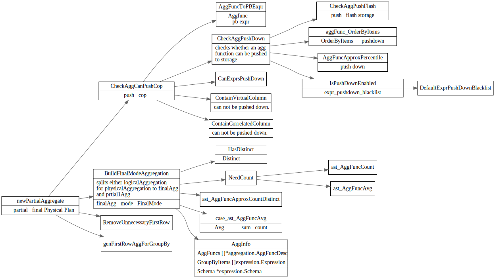

# Agg
<!-- toc -->

## LogicalAggregation

```go
type LogicalAggregation struct {
	logicalSchemaProducer

	AggFuncs     []*aggregation.AggFuncDesc
	GroupByItems []expression.Expression

	// aggHints stores aggregation hint information.
	aggHints aggHintInfo

	possibleProperties [][]*expression.Column
	inputCount         float64 // inputCount is the input count of this plan.

	// noCopPushDown indicates if planner must not push this agg down to coprocessor.
	// It is true when the agg is in the outer child tree of apply.
	noCopPushDown bool
}

type aggHintInfo struct {
	preferAggType  uint
	preferAggToCop bool
}
```
## aggregationPushDownSolver

## findBestTask


### TaskType

```go
	// CopSingleReadTaskType stands for the a TableScan or IndexScan tasks
	// executed in the coprocessor layer.
	CopSingleReadTaskType

	// CopDoubleReadTaskType stands for the a IndexLookup tasks executed in the
	// coprocessor layer.
	CopDoubleReadTaskType

	// CopTiFlashLocalReadTaskType stands for flash coprocessor that read data locally,
	// and only a part of the data is read in one cop task, if the current task type is
	// CopTiFlashLocalReadTaskType, all its children prop's task type is CopTiFlashLocalReadTaskType
	CopTiFlashLocalReadTaskType

	// CopTiFlashGlobalReadTaskType stands for flash coprocessor that read data globally
	// and all the data of given table will be read in one cop task, if the current task
	// type is CopTiFlashGlobalReadTaskType, all its children prop's task type is
	// CopTiFlashGlobalReadTaskType
	CopTiFlashGlobalReadTaskType

	// MppTaskType stands for task that would run on Mpp nodes, currently meaning the tiflash node.
	MppTaskType
```

### newPartialAggregate



#### CheckAggPushFlash
```go
func CheckAggPushFlash(aggFunc *AggFuncDesc) bool {
	switch aggFunc.Name {
	case ast.AggFuncSum, ast.AggFuncCount, ast.AggFuncMin, ast.AggFuncMax, ast.AggFuncAvg, ast.AggFuncFirstRow, ast.AggFuncApproxCountDistinct:
		return true
	}
	return false
}
```
#### expr_pushdown_blacklist
该blacklist 存在mysql.expr_pushdown_blacklist表中
```go
func LoadExprPushdownBlacklist(ctx sessionctx.Context) (err error) {
	sql := "select HIGH_PRIORITY name, store_type from mysql.expr_pushdown_blacklist"
	rows, _, err := ctx.(sqlexec.RestrictedSQLExecutor).ExecRestrictedSQL(sql)
  }
```
#### 对Distinct特殊处理

```go
		if aggFunc.HasDistinct {
			/*
				eg: SELECT COUNT(DISTINCT a), SUM(b) FROM t GROUP BY c

				change from
					[root] group by: c, funcs:count(distinct a), funcs:sum(b)
				to
					[root] group by: c, funcs:count(distinct a), funcs:sum(b)
						[cop]: group by: c, a
			*/
```

#### 对first row function 特殊处理

```go
					if !partialIsCop {
						// if partial is a cop task, firstrow function is redundant since group by items are outputted
						// by group by schema, and final functions use group by schema as their arguments.
						// if partial agg is not cop, we must append firstrow function & schema, to output the group by
						// items.
						// maybe we can unify them sometime.
```

## ToPB


