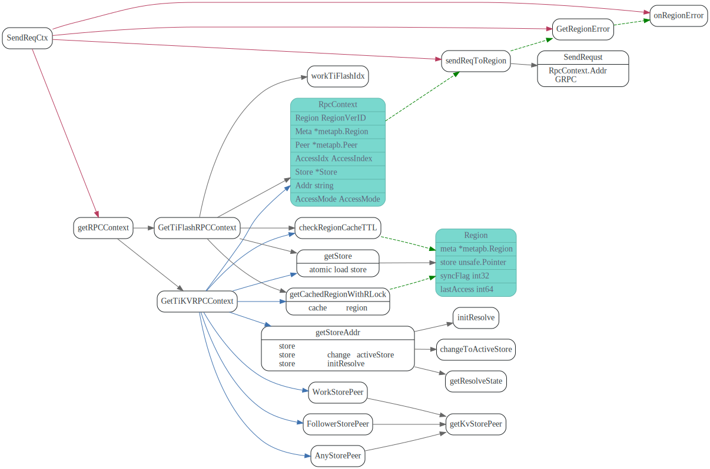

# ReginCache

<!-- toc -->

## 简介

TiKV中数据是按照Region为单位存储key,value的，
TiDB拿到key, 或者key range之后，需要定位去哪个TiKV服务去取数据。

PDServer(placement driver)就是用来做这个事情的，TiDB需要先去PDserver
获取region leader的addr,然后再向TiKV发起请求。

为了提高效率，TiDB 本地对region做了一层cache，避免每次都要向Pd server发请求。
TiKV层region split之后，TiDB的cache就过期了，这时候，TiDB去TikV发请求，TiKV
会返回错误，然后TiDB根据错误信息，更新region Cache.


## CopClient.Send


## LocateKey


## RegionStore

RegionStore represents region stores info


## SendReqCtx

根据RegionVerID，去cache中获取region, 然后获取peer(TiKV/TiFlash)的addr
发送GRPC请求.



## onRegionError

TiKV返回RegionError, TiDB根据error 信息更新本地RegionCache


# Trash
buildCopTasks首先会通过从RegionCache中找到keyRange对应的regions, 
会先去RegionCache中取LocateKey查找key所在的region, 如果cache中
没有则会去pd server中查找, 并将region信息保存到pd cache.


在CopIterworker run goroutine中，在发送请求给region之前，会在GetTiKVRPCContext
中，通过regionVerID获取tikv server addr，这个地方类似也有cache, 从cache获取
失败，会去pd server中调用GetStore rpc调用了来获取store addr.

`RegionCache`相关数据结构如下:

```go
// RegionCache caches Regions loaded from PD.
type RegionCache struct {
	pdClient pd.Client

	mu struct {
		sync.RWMutex                         // mutex protect cached region
		regions      map[RegionVerID]*Region // cached regions be organized as regionVerID to region ref mapping
		sorted       *btree.BTree            // cache regions be organized as sorted key to region ref mapping
	}
	storeMu struct {
		sync.RWMutex
		stores map[uint64]*Store
	}
	notifyCheckCh chan struct{}
	closeCh       chan struct{}
}
// RegionVerID is a unique ID that can identify a Region at a specific version.
type RegionVerID struct {
	id      uint64
	confVer uint64
	ver     uint64
}

// Region presents kv region
type Region struct {
	meta       *metapb.Region // raw region meta from PD immutable after init
	store      unsafe.Pointer // point to region store info, see RegionStore
	syncFlag   int32          // region need be sync in next turn
	lastAccess int64          // last region access time, see checkRegionCacheTTL
}

// RegionStore represents region stores info
// it will be store as unsafe.Pointer and be load at once
type RegionStore struct {
	workTiKVIdx    AccessIndex          // point to current work peer in meta.Peers and work store in stores(same idx) for tikv peer
	workTiFlashIdx int32                // point to current work peer in meta.Peers and work store in stores(same idx) for tiflash peer
	stores         []*Store             // stores in this region
	storeEpochs    []uint32             // snapshots of store's epoch, need reload when `storeEpochs[curr] != stores[cur].fail`
	accessIndex    [NumAccessMode][]int // AccessMode => idx in stores
}

// Store contains a kv process's address.
type Store struct {
	addr         string        // loaded store address
	saddr        string        // loaded store status address
	storeID      uint64        // store's id
	state        uint64        // unsafe store storeState
	resolveMutex sync.Mutex    // protect pd from concurrent init requests
	epoch        uint32        // store fail epoch, see RegionStore.storeEpochs
	storeType    kv.StoreType  // type of the store
	tokenCount   atomic2.Int64 // used store token count
}
```

在CopIterworker中发送请求失败后，会调用`onRegionError`更新RegionCache中信息。


